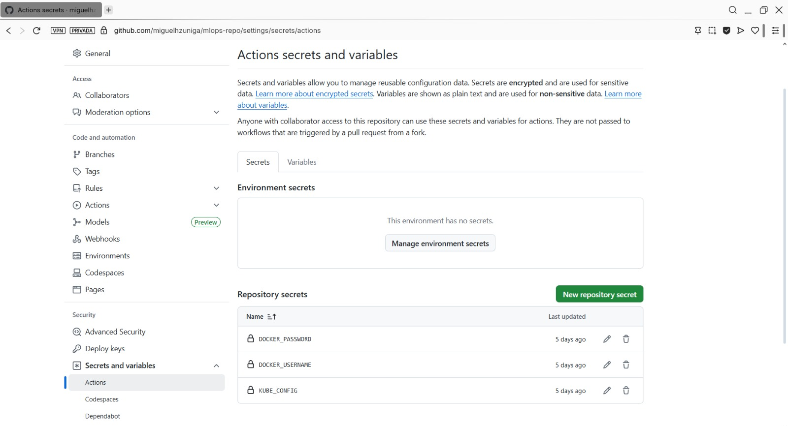
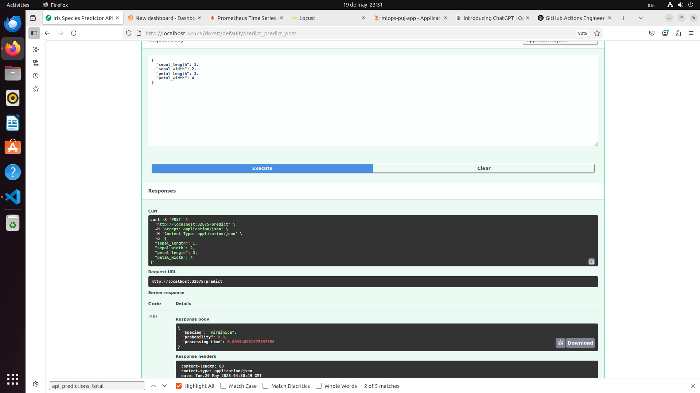
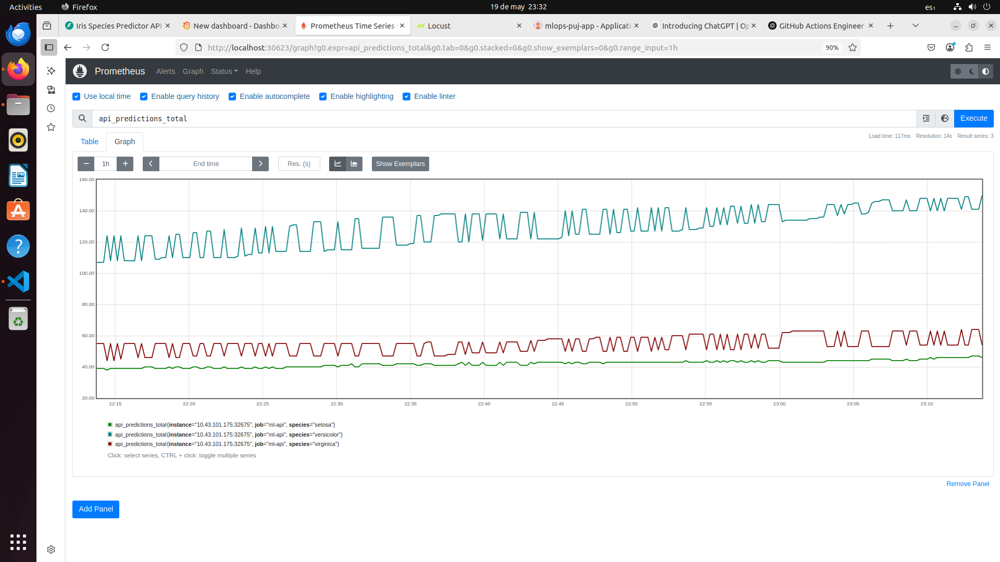
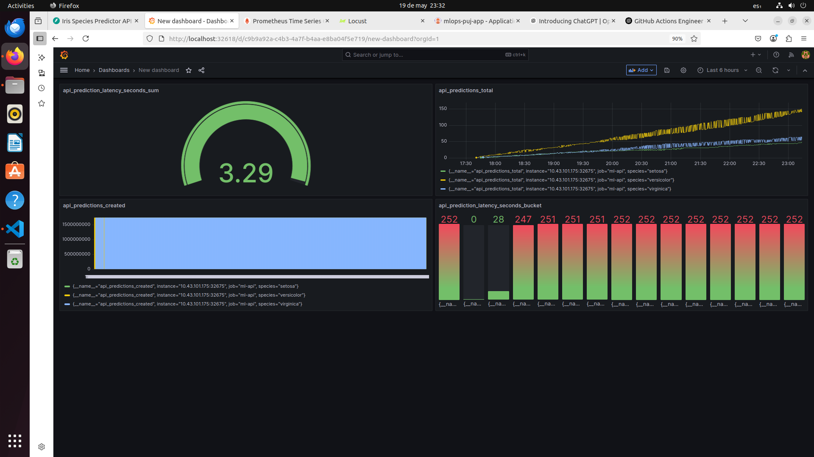
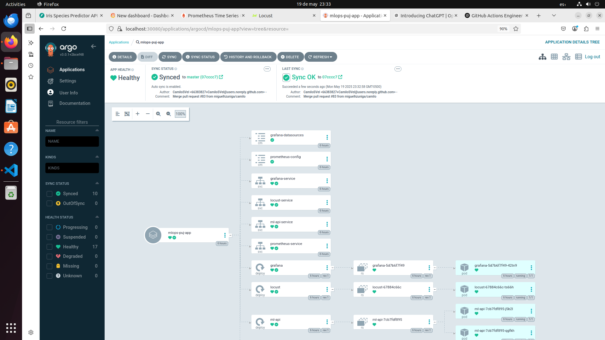
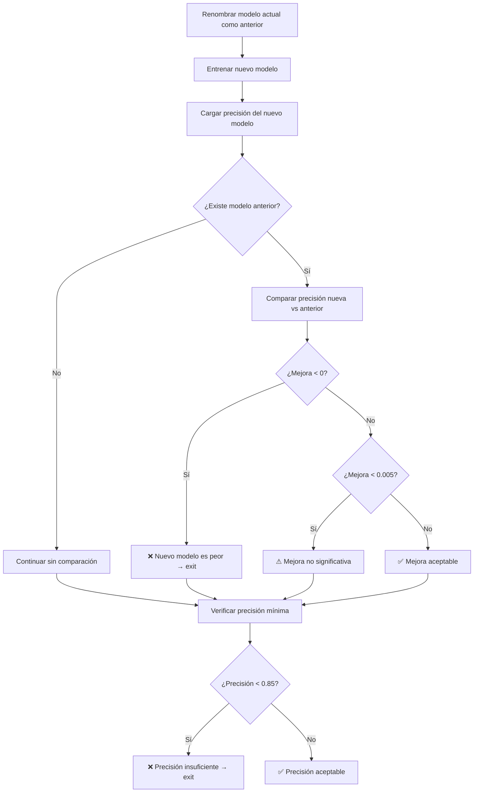
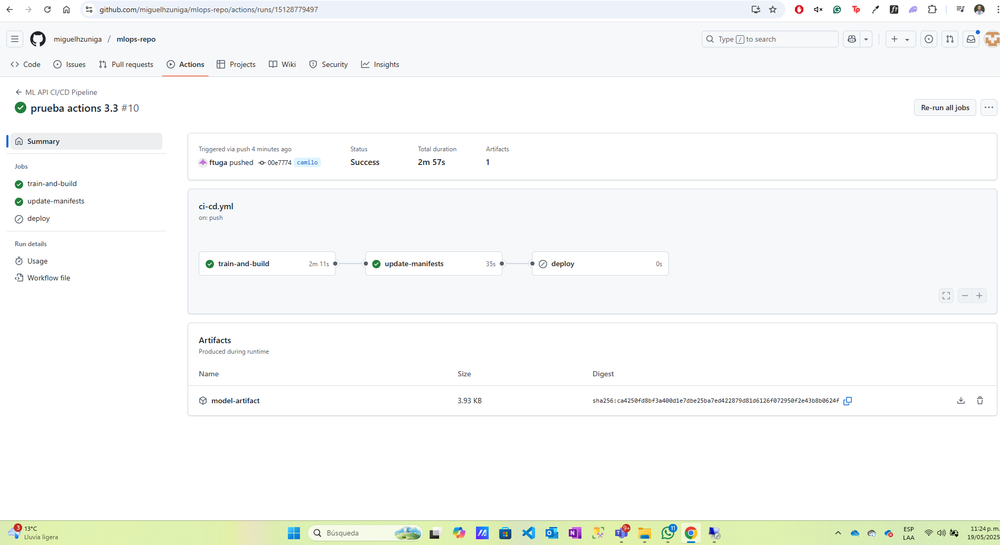

# CI/CD y GitOps para Despliegue de API de IA

Este proyecto implementa una arquitectura CI/CD completa con GitOps para desplegar una API FastAPI que utiliza un modelo de machine learning, instrumentada con métricas de Prometheus y visualizada con Grafana.

## Arquitectura del Proyecto

El proyecto implementa un pipeline completo que incluye:

1. **Entrenamiento del modelo**: Un script entrena un modelo KNN para clasificación de flores Iris
2. **API de predicción**: Una API FastAPI que expone el modelo entrenado
3. **Instrumentación**: La API expone métricas para Prometheus
4. **LoadTester**: Un componente que envía peticiones aleatorias a la API
5. **Observabilidad**: Prometheus y Grafana para monitorizar el sistema
6. **CI/CD**: GitHub Actions para automatizar el entrenamiento, construcción y despliegue
7. **GitOps**: Argo CD para sincronizar el estado del clúster con el código en Git

## Estructura del Proyecto

```
./
├── .github/workflows/
│   └── ci-cd.yml               # Workflow de GitHub Actions
├── api/
│   ├── app/
│   │   ├── main.py             # API FastAPI
│   │   └── model.pkl           # Modelo entrenado
│   ├── data/                   # Carpeta para datos de entrenamiento
│   │   └── iris.csv            # Dataset para entrenar el modelo
│   ├── data_preparation.py     # Preprocesamiento de datos
│   ├── model_creation.py       # Creación del modelo KNN
│   ├── main-train.py           # Funciones de entrenamiento
│   ├── train_model.py          # Script principal de entrenamiento
│   ├── Dockerfile              # Dockerfile de la API
│   └── requirements.txt        # Dependencias Python
├── loadtester/
│   ├── main.py                 # Script de prueba de carga
│   ├── Dockerfile              # Dockerfile del LoadTester
│   └── requirements.txt        # Dependencias Python
├── manifests/
│   ├── api-deployment.yaml     # Deployment y Service de la API
│   ├── script-deployment.yaml  # Deployment del LoadTester
│   ├── prometheus-deployment.yaml  # Deployment y ConfigMap de Prometheus
│   ├── grafana-deployment.yaml # Deployment y ConfigMap de Grafana
│   ├── grafana-config/         # Configuración de Grafana
│   │   └── datasources.yaml    # Fuentes de datos de Grafana
│   └── kustomization.yaml      # Configuración de Kustomize
├── argo-cd/
│   └── app.yaml                # Configuración de Argo CD
├── deploy.sh                   # Script de despliegue automatizado
├── deploy-argocd.sh            # Script para desplegar Argo CD
└── README.md                   # Este archivo
```

## Requisitos Previos

- Docker
- Kubernetes (MicroK8s o Minikube)
- Python 3.10+ 
- Git
- Cuenta en Docker Hub (para publicar imágenes)
- Cuenta en GitHub (para CI/CD y GitOps)

## Guía de Instalación

### 1. Clonar el repositorio

```bash
git clone <URL_DEL_REPOSITORIO>
cd <NOMBRE_DEL_REPOSITORIO>
```

### 2. Ejecutar el script de despliegue principal

El script `deploy.sh` automatiza el proceso de instalación y despliegue de la aplicación principal:

```bash
chmod +x deploy.sh
./deploy.sh
```

Este script:
- Verifica e instala las dependencias necesarias
- Entrena el modelo de IA
- Construye y opcionalmente publica las imágenes Docker
- Configura el clúster Kubernetes (MicroK8s o Minikube)
- Despliega la aplicación en Kubernetes

### 3. Desplegar Argo CD

Después de ejecutar el script principal, despliega Argo CD con:

```bash
chmod +x deploy-argocd.sh
./deploy-argocd.sh
```

Este script complementario:
- Instala Argo CD en el clúster Kubernetes
- Configura la aplicación en Argo CD
- Establece port-forwarding para acceder a la interfaz de Argo CD
- Al final del deployment se indicará el usuario y la contraseña para ingresar a la interfaz de este.

### 4. Configurar Secretos en GitHub

Para habilitar el pipeline de CI/CD, necesitas configurar estos secretos en tu repositorio GitHub:

1. Ve a tu repositorio → Settings → Secrets and variables → Actions
2. Agrega los siguientes secretos:
   - `DOCKER_USERNAME`: Tu usuario de Docker Hub
   - `DOCKER_PASSWORD`: Tu contraseña de Docker Hub
   - `KUBE_CONFIG`: El contenido codificado en base64 de tu archivo kubeconfig (obtenerlo con `cat ~/.kube/config | base64 -w 0`)



## Uso del Sistema

### Acceso a los Servicios

Después de ejecutar los scripts de despliegue, podrás acceder a:

- **API**: http://localhost:32675
  - Endpoint de predicción: `POST /predict`
  - Ejemplo: 
    ```bash
    curl -X POST http://localhost:32675/predict \
      -H "Content-Type: application/json" \
      -d '{"sepal_length": 5.1, "sepal_width": 3.5, "petal_length": 1.4, "petal_width": 0.2}'
    ```
  - Endpoint de métricas: `GET /metrics`



- **Prometheus**: http://localhost:30623
  - Métricas disponibles:
    - `api_predictions_total`: Contador de predicciones por especie
    - `api_prediction_latency_seconds`: Histograma de latencia de predicción



- **Grafana**: http://localhost:32618
  - Usuario: `admin`
  - Contraseña: `admin`
  - Prometheus ya está configurado como fuente de datos



- **Argo CD**: https://localhost:8080 / https://localhost:30080
  - Usuario: `admin`
  - Contraseña: Se muestra durante la ejecución del script `deploy-argocd.sh`
  - También puedes obtenerla con: 
    ```bash
    sudo microk8s kubectl -n argocd get secret argocd-initial-admin-secret -o jsonpath="{.data.password}" | base64 -d
    ```


### Detener los Port-Forwards

Para detener todos los port-forwards:

```bash
./stop_port_forwards.sh
```

## Flujo de CI/CD y GitOps

1. **Desarrollo Local**: Modificas el código y lo pruebas localmente
2. **Commit y Push**: Envías los cambios a GitHub
3. **GitHub Actions**: Se activa automáticamente y:
   - Entrena el modelo
   - Construye y publica las imágenes Docker con un tag único basado en el SHA del commit
   - Actualiza los manifiestos con el nuevo tag de imagen
  





4. **Argo CD**: Detecta los cambios en los manifiestos y sincroniza el estado del clúster

## Detalles del Sistema

### API de ML

La API implementa:
- Modelo KNN para clasificación de flores Iris
- Endpoints REST para predicciones
- Instrumentación con Prometheus

### Observabilidad

- **Prometheus**: Recolecta métricas de la API
  - Contador de predicciones
  - Histograma de latencia
  
- **Grafana**: Visualiza las métricas
  - Dashboard predefinido para monitoreo


### GitOps con Argo CD

Argo CD implementa el enfoque GitOps:
- El repositorio Git es la única fuente de verdad
- Los cambios se aplican automáticamente al sistema
- La sincronización es bidireccional

## Solución de Problemas

### Problemas con Python 3.12

Si encuentras errores al instalar scikit-learn o numpy en Python 3.12:

```
Cython.Compiler.Errors.CompileError: sklearn/cluster/_hierarchical_fast.pyx
```

**Soluciones:**

1. **Actualizar dependencias en requirements.txt**:
   ```
   numpy>=1.26.0
   scikit-learn>=1.3.2
   ```

2. **Usar Python 3.10 o 3.11** (más estable para bibliotecas científicas)

### Problemas con MicroK8s

Si encuentras problemas de conexión con MicroK8s:

1. **Reiniciar MicroK8s**:
   ```bash
   sudo microk8s stop
   sudo microk8s start
   ```

2. **Verificar el estado**:
   ```bash
   microk8s status
   ```

3. **Error "connection refused" en el puerto 16443**:
   - Este es un problema común al aplicar manifiestos
   - Usa la opción `--validate=false` con kubectl
   - Asegúrate de que el addon DNS esté habilitado: `microk8s enable dns`

4. **Si se cierra la terminal y la interfaz de ArgoCD se detiene.** 

    Ejecuta este comando para modificar el tipo de servicio de Argo CD para exponerlo como un NodePort. Es decir, se podrá acceder desde fuera del clúster a través del nodo y un puerto específico:
   ```bash
    kubectl patch svc argocd-server -n argocd -p '{
      "spec": {
        "type": "NodePort",
        "ports": [
          {
            "name": "http",
            "nodePort": 30080,
            "port": 80,
            "protocol": "TCP",
            "targetPort": 8080
          },
          {
            "name": "https",
            "nodePort": 30443,
            "port": 443,
            "protocol": "TCP",
            "targetPort": 8080
          }
        ]
      }
    }'

   ```
   Ahora podrás acceder a ArgoCD desde https://10.43.101.175:30080/

### Verificar los Logs

Para verificar los logs de los servicios:

```bash
# API
sudo microk8s kubectl logs -l app=ml-api -n mlops-puj

# LoadTester
sudo microk8s kubectl logs -l app=load-tester -n mlops-puj

# Prometheus
sudo microk8s kubectl logs -l app=prometheus -n mlops-puj

# Grafana
sudo microk8s kubectl logs -l app=grafana -n mlops-puj

# Argo CD
sudo microk8s kubectl logs -l app=argocd-server -n argocd
```

# Conclusión

Este proyecto demuestra una implementación completa de CI/CD y GitOps para el despliegue de una API de IA en un entorno Kubernetes. La arquitectura integra múltiples tecnologías modernas para crear un pipeline robusto que abarca desde el entrenamiento del modelo hasta el monitoreo en producción.

Las principales ventajas de esta implementación incluyen:

- Automatización completa desde el entrenamiento del modelo hasta su despliegue
- Observabilidad integral mediante la instrumentación con Prometheus y visualización con Grafana
- Enfoque GitOps que garantiza que el código sea la única fuente de verdad
- Arquitectura escalable y mantenible con componentes claramente separados
- Infraestructura como código que facilita la reproducibilidad del entorno

Esta solución proporciona una base sólida para equipos de MLOps que buscan implementar prácticas DevOps en proyectos de machine learning, permitiendo entregas continuas, monitoreo efectivo y una experiencia de desarrollo fluida.

La documentación detallada, los scripts de automatización y la estructura organizada del proyecto facilitan su adopción y adaptación para casos de uso específicos, demostrando un enfoque profesional para el ciclo de vida completo de aplicaciones basadas en IA.

# Autores:
- Luis Frontuso
- Miguel Zuñiga
- Camilo Serrano
