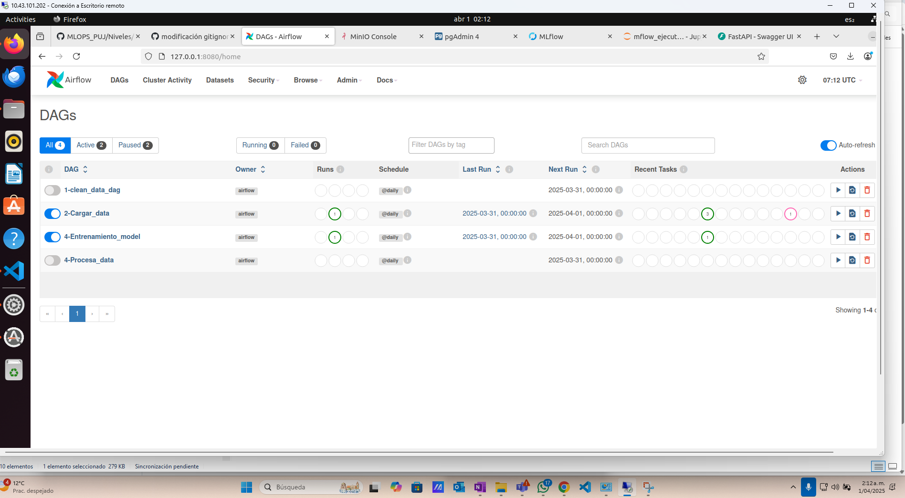
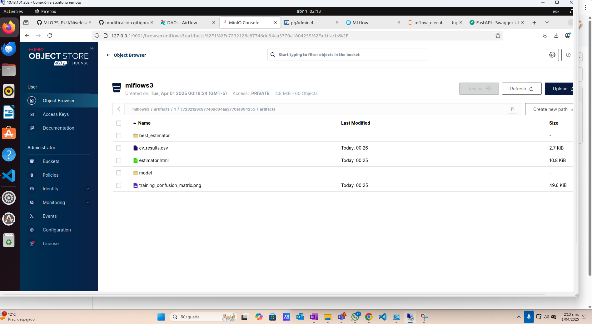
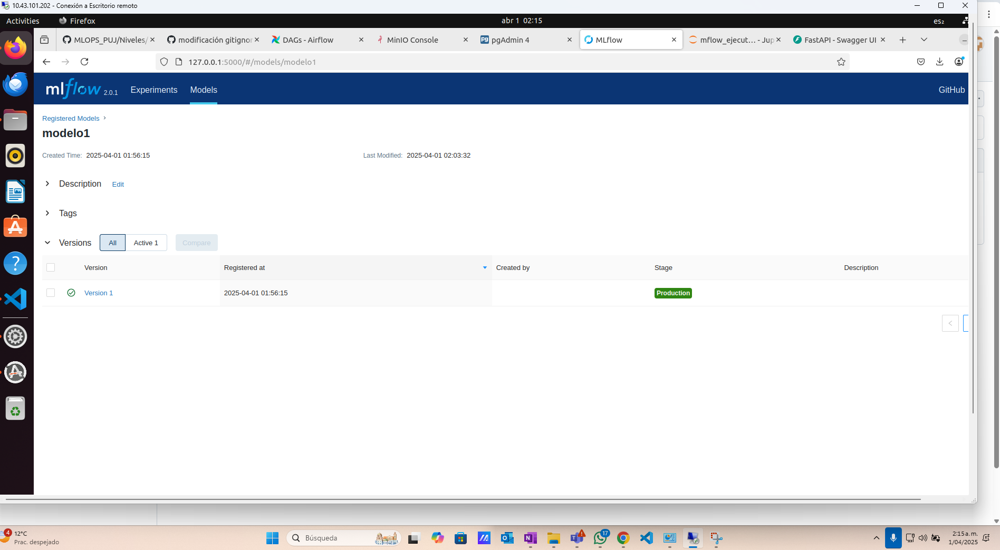
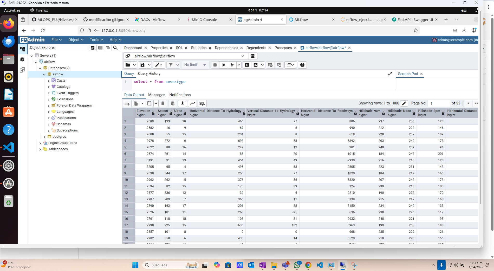
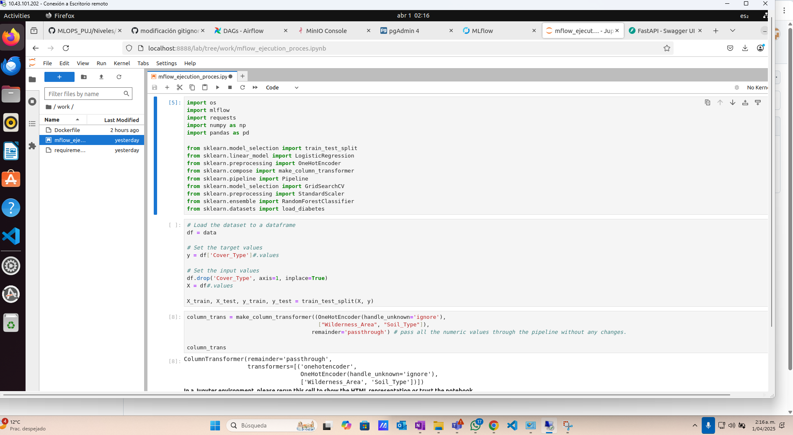
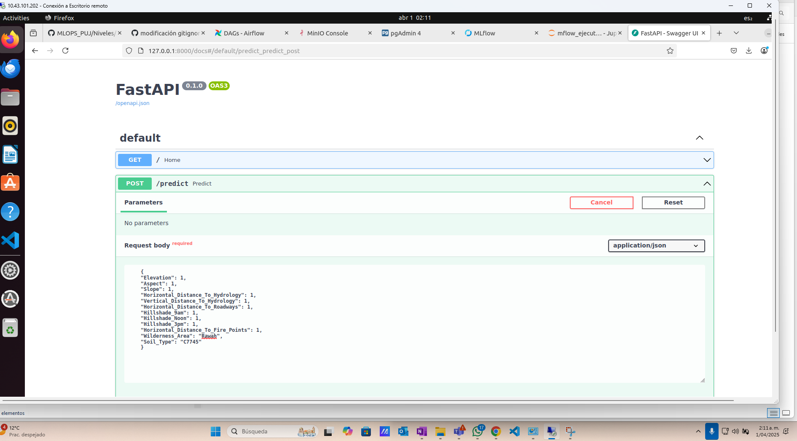
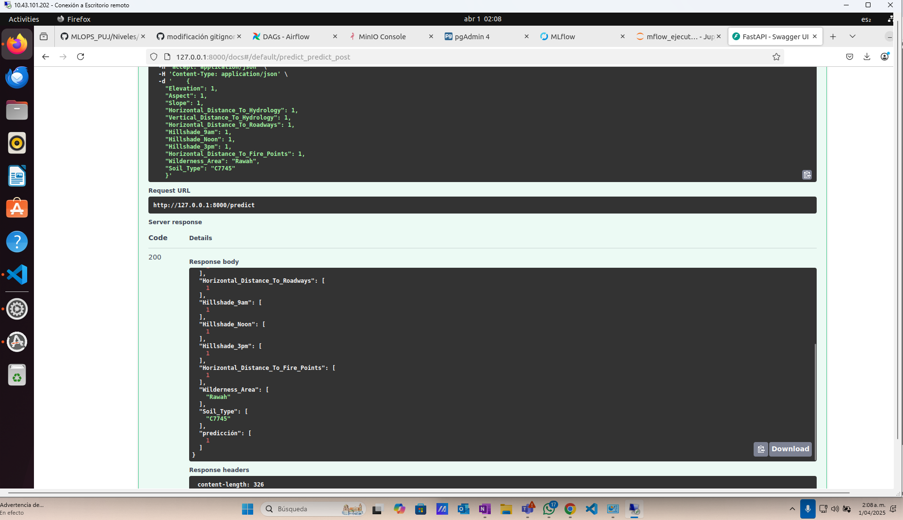

# README para el Clúster de Airflow con CeleryExecutor, Redis y PostgreSQL

Este repositorio configura un entorno de desarrollo local para ejecutar Apache Airflow con CeleryExecutor, Redis como broker de tareas y PostgreSQL como backend de la base de datos. Además, el entorno incluye MinIO para almacenamiento de artefactos, MySQL para almacenar metadata de MLFlow, PgAdmin para monitorear la base de datos de airflow y JupyterLab como ambiente de desarrollo.

---

## Servicios en Docker Compose

El entorno de desarrollo está compuesto por varios contenedores Docker que incluyen Airflow, bases de datos, almacenamiento de artefactos y más. A continuación, se describen los servicios principales:

### 1. **Airflow**: Clúster con CeleryExecutor

Airflow se ejecuta utilizando CeleryExecutor, y se conecta a Redis para la gestión de tareas y PostgreSQL para el almacenamiento de metadatos.

- **Airflow Webserver**: Accede a la UI de Airflow en `http://localhost:8080`
- **Airflow Scheduler**: Controla la ejecución de tareas programadas.
- **Airflow Worker**: Ejecuta las tareas programadas por el scheduler.
- **Airflow Triggerer**: Gestiona trabajos que activan tareas manualmente.

  

### 2. **Redis**: Broker de Celery

Redis se usa como broker para las tareas de Celery. Es necesario para la comunicación entre el `Scheduler` y los `Workers` de Airflow.

### 3. **PostgreSQL**: Backend de Airflow

PostgreSQL se usa como base de datos para almacenar los metadatos de Airflow. Se conecta con los `Scheduler` y `Workers`.

### 4. **MinIO**: Almacenamiento S3

MinIO emula un almacenamiento tipo S3, utilizado para almacenar los artefactos de MLFlow.

- Accede a la consola web de MinIO en `http://localhost:9001` utilizando las credenciales:
  - Usuario: `admin`
  - Contraseña: `supersecret`

- Se debe crear el bucket para almacenar los artefactos de MLFLOW en la interfaz gráfica por medio del botón "Create bucket" y este debe llamarse mlflows3 para que mlflow pueda reconocerlo y se guarde la información.



### 5. **MLFlow**: Plataforma de Gestión de Experimentos

MLFlow se utiliza para el seguimiento de experimentos de Machine Learning. Se conecta a MySQL para almacenar metadatos.

- Accede a la interfaz web de MLFlow en `http://localhost:5000`.



### 6. **PgAdmin**: Interfaz de Administración de PostgreSQL

PgAdmin proporciona una interfaz gráfica para gestionar la base de datos de PostgreSQL.

- Accede a la interfaz web de PgAdmin en `http://localhost:5050`.
  - Usuario: `admin@example.com`
  - Contraseña: `admin`
Se debe registrar la base de datos con:
- hostname: postgres
- user: airflow
- password: airflow

De este modo se puede comprobar que los datos que airflow genera con el dag Cargar_datos.py están cargados a la base de datos de Postgresql



### 7. **MySQL**: Base de Datos de MLFlow

MySQL se usa para almacenar los metadatos de MLFlow. Se conecta con el contenedor de MLFlow.

### 8. **JupyterLab**: Entorno de Desarrollo

JupyterLab proporciona un entorno interactivo para desarrollo y pruebas. Puedes acceder a él en `http://localhost:8888` usando el token `devtoken`.



### 9. **FastAPI (API)**: API de Inferencia

FastAPI proporciona un servidor para exponer endpoints que interactúan con otros servicios como Airflow y MLFlow. Accede al servidor en `http://localhost:8000/docs`.

Aqui se puede utilizar el mejor modelo generado tras los experimentos de MLFLOW para realizar inferencia.

* Nota: el modelo debe estar en estado de producción en Mlflow y debe llamarse modelo1.



### 10. **FastAPI (API Server)**: Servidor de API

Esta API simula una URL de internet que provee un batch de datos cada 5 segundos, para un total de 10 batches, los cuales serán utilizados para entrenar posteriormente el modelo en airflow y registrar los experimentos y el mejor modelo en mlflow
`http://localhost:80`.

---

## Uso

Para ejecutar los contenedores y configurar el entorno, sigue estos pasos:

1. **Construir los contenedores**:

   En el directorio raíz del proyecto, ejecuta:

   ```bash
   docker-compose up -d --build
   ```
    Para ver el estatus de los servicios:
   ```bash
   docker-compose ps
   ```
    Para bajar los servicios:
   ```bash
   docker-compose down
   ```

   Para bajar los servicios limpiando todo:
   ```bash
   docker-compose down --volumes --remove-orphans
   ```

2. **Prender dags programados**:

    En airflow existen 4 dags que se ejecutan diariamente desde el 30 de marzo del 2025:
    1. Borrar_datos: limpia la base de datos si existe. Se ejecuta posterior a la generación del modelo y está programado 1 hora después de el primer dag. 
    2. Cargar_datos: trae los datos consolidados de la api server tarda aproximadamente 50 segundos y está programado a las 0 horas.
    3. Entrenamiento_mode: entrena un RandomForest con los datos cargados, el cual está programado 2 minutos después de cargar los datos.
    4. Procesa_data: genera experimentos para encontrar los mejores hiperparámetros y por ende el mejor modelo que será utilizado posteriormente por el usuario. Se ejecuta 10 minutos después de cargar los datos.


    * La ejecución recomendada para efectuar el proceso por completo es ejecutar los dags en el orden en el que están enumerados: primero se limpia la base de datos si existe, se cargan los datos, se entrena el modelo y se genera experimentos.

3. **Inferencia en API**:
    Tras la ejecución de los dags, el usuario ingresará a `http://localhost:8000/docs`, donde podrá hacer inferencia con el modelo utilizando un json como el siguiente ejemplo:

    ```python
    {
    "Elevation": 1,
    "Aspect": 1,
    "Slope": 1,
    "Horizontal_Distance_To_Hydrology": 1,
    "Vertical_Distance_To_Hydrology": 1,
    "Horizontal_Distance_To_Roadways": 1,
    "Hillshade_9am": 1,
    "Hillshade_Noon": 1,
    "Hillshade_3pm": 1,
    "Horizontal_Distance_To_Fire_Points": 1,
    "Wilderness_Area": "Rawah",
    "Soil_Type": "C7745"
    }
    ```

    Esto generará como resultado:

    

Autores:

* Luis Frontuso
* Miguel Zuñiga
* Camilo Serrano
