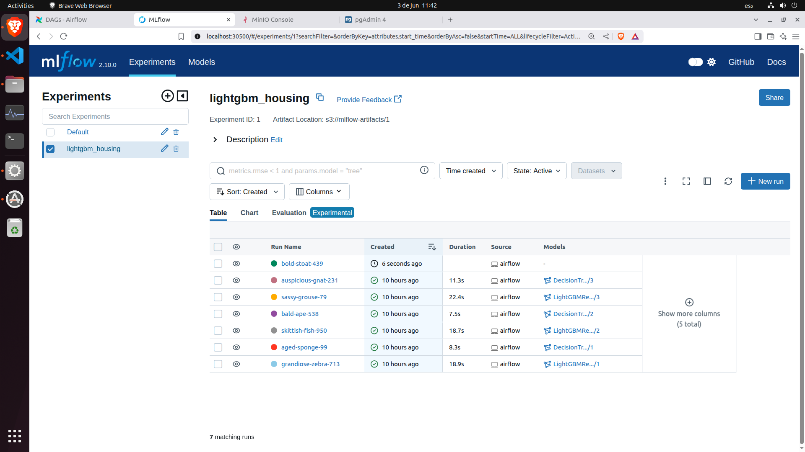
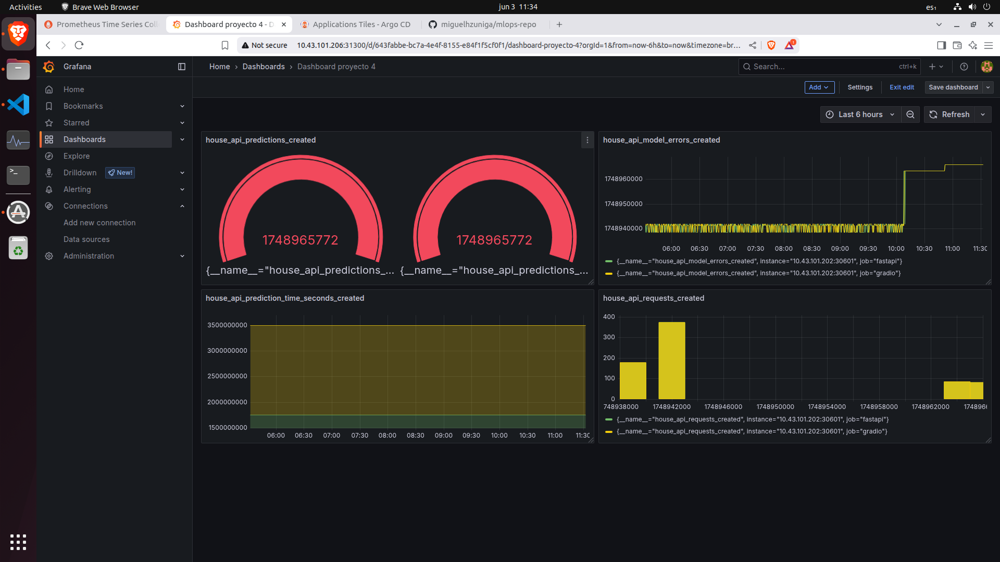

# Proyecto Final - Operaciones de Machine Learning
## Sistema MLOps para Predicción de Precios de Bienes Raíces

### Video del proyecto

A continuación puede acceder al video explicativo del proyecto:

[Proyecto final MLOPS](https://youtu.be/gQF0ej60K2c)

### 🎯 Descripción General

Este proyecto implementa una plataforma MLOps empresarial completa para la predicción automatizada de precios de propiedades inmobiliarias. El sistema integra las mejores prácticas de DevOps, MLOps y observabilidad, proporcionando un flujo de trabajo automatizado desde la recolección de datos hasta el despliegue en producción con CI/CD completo.

### 🏗️ Arquitectura del Sistema

La solución está diseñada con una arquitectura distribuida de microservicios desplegada en tres máquinas virtuales especializadas:

- **🔄 Máquina 01 - Data & ML Pipeline**: Orquestación con Airflow y registro de experimentos con MLflow
- **🚀 Máquina 02 - Servicios de Inferencia**: API REST (FastAPI) e interfaz de usuario (Gradio)
- **📊 Máquina 03 - GitOps & Observabilidad**: Despliegue continuo (Argo CD) y monitorización (Prometheus + Grafana)


### 📦 **Workflow: "Construir y Subir Imágenes MLOps"**

El pipeline automatiza completamente el ciclo de vida del software con 6 etapas principales:

#### **1. 🏗️ Builds Paralelos de Imágenes**
```yaml
jobs:
  build-airflow:    # 🔄 Imagen Airflow
  build-mlflow:     # 📊 Imagen MLflow  
  build-fastapi:    # ⚡ Imagen FastAPI
  build-gradio:     # 🎨 Imagen Gradio
```

**Características**:
- ✅ Builds paralelos para máxima eficiencia
- 🏷️ Tagging automático por rama y SHA
- 🌐 Multi-arquitectura (AMD64 + ARM64)
- 📦 Caché optimizado GitHub Actions
- 🐳 Push automático a Docker Hub

#### **2. 🏷️ Sistema de Tagging Inteligente**
```bash
# Rama master (producción)
Tag: YYYYMMDD-{short-sha}    # Ej: 20250603-a1b2c3d

# Ramas de desarrollo  
Tag: {branch-name}           # Ej: feature-new-model
```

#### **3. 📝 Actualización Automática de Manifiestos**
```yaml
actualizar-manifiestos:
  needs: [build-airflow, build-mlflow, build-fastapi, build-gradio]
  if: github.ref == 'refs/heads/master'
```

**Proceso**:
1. 🔍 Detecta nuevos tags de imagen
2. 📝 Actualiza manifiestos Kubernetes automáticamente
3. 💾 Commit y push de cambios
4. 🔄 Dispara sincronización de Argo CD

#### **4. 🎯 Distribución por Máquina**

| Máquina | Componente | Despliegue | Manifiesto |
|---------|------------|------------|------------|
| 01 | Airflow | Docker Compose | Manual |
| 01 | MLflow | Argo CD | `mlflow/manifests/mlflow.yaml` |
| 02 | FastAPI | Argo CD | `fastapi/fastapi-deployment.yaml` |
| 02 | Gradio | Argo CD | `gradio/gradio-deployment.yaml` |

#### **5. ⚡ Triggers del Pipeline**

**Push a Master** (Producción):
```yaml
on:
  push:
    branches: [ master ]
    paths:
      - 'proyecto-04/01_Primera_maquina/airflow/**'
      - 'proyecto-04/01_Primera_maquina/mlflow/**'  
      - 'proyecto-04/02_Segunda_maquina/api/**'
```

**Pull Requests** (Testing):
```yaml
on:
  pull_request:
    branches: [ master ]
```

#### **6. 📊 Monitorización y Reportes**
```bash
✅ Pipeline Status:
• Build Airflow:          success
• Build MLflow:           success  
• Build FastAPI:          success
• Build Gradio:           success
• Actualizar Manifiestos: success

📦 Imágenes en Docker Hub:
• username/airflow-houses:20250603-a1b2c3d  (Ejemplo)
• username/mlflow-houses:20250603-a1b2c3d   (Ejemplo)
• username/fastapi-houses:20250603-a1b2c3d  (Ejemplo)
• username/gradio-houses:20250603-a1b2c3d   (Ejemplo)
```

---

## 🔐 Configuración de Secrets

### **GitHub Secrets Requeridos**:
```bash
DOCKER_USERNAME= Usuario-dockerhub
DOCKER_PASSWORD= Token-dockerhub
GITHUB_TOKEN= Auto-generado
```

### **Permisos GitHub Actions**:
```yaml
permissions:
  contents: write    # Para commits automáticos
  packages: write    # Para Docker registry
  actions: read      # Para workflows
```

---

## 🚀 Flujo de Despliegue Completo

### **1. 👨‍💻 Desarrollo**
```bash
# Developer pushea código
git push origin feature-nueva-funcionalidad
```

### **2. 🔄 CI/CD Pipeline**


### **3. 📦 GitOps con Argo CD**
```bash
# Argo CD detecta cambios (3 min)
Sync Status: OutOfSync → Syncing → Healthy

# Aplicaciones monitoreadas:
• mlflow-app      (Máquina 01)
• fastapi-app     (Máquina 02)  
• gradio-app      (Máquina 02)
```

### **4. 🎯 Despliegue por Máquina**

#### **Máquina 01 - Automático/Manual**:
```bash
# MLflow (Automático vía Argo CD)
kubectl set image deployment/mlflow mlflow=user/mlflow-houses:new-tag

# Airflow (Manual - Docker Compose)
cd airflow && docker-compose pull && docker-compose up -d
```

#### **Máquina 02 - Automático**:
```bash
# FastAPI (Automático vía Argo CD)
kubectl set image deployment/fastapi-housing fastapi=user/fastapi-houses:new-tag

# Gradio (Automático vía Argo CD)  
kubectl set image deployment/gradio-housing gradio=user/gradio-houses:new-tag
```

#### **Máquina 03 - Gestión**:
```bash
# Monitoreo en tiempo real
Argo CD:    https://localhost:30443
Grafana:    https://localhost:30000
Prometheus: https://localhost:30090
```

---


### 📊 Dataset y Fuente de Datos

Los datos provienen de **Realtor.com**, el segundo sitio web de bienes raíces más visitado de Estados Unidos, con más de 100 millones de usuarios activos mensuales. La información se obtiene de una API externa que simula la llegada incremental de datos en un entorno productivo.

#### Variables del Dataset

| Variable | Tipo | Descripción |
|----------|------|-------------|
| `brokered_by` | Categórica | Agencia/corredor inmobiliario |
| `status` | Categórica | Estado: lista para venta/construcción |
| `price` | Numérica | Precio objetivo (variable a predecir) |
| `bed` | Numérica | Número de habitaciones |
| `bath` | Numérica | Número de baños |
| `acre_lot` | Numérica | Tamaño del terreno en acres |
| `street` | Categórica | Dirección (codificada) |
| `city` | Categórica | Ciudad |
| `state` | Categórica | Estado |
| `zip_code` | Categórica | Código postal |
| `house_size` | Numérica | Área habitable en pies cuadrados |
| `prev_sold_date` | Temporal | Fecha de venta anterior |

**🎯 Objetivo**: Predecir el precio de una propiedad basándose en sus características físicas y de ubicación.

### 📁 Estructura del Proyecto

```
proyecto-04/
├── 01_Primera_maquina/
│   ├── airflow/
│   │   ├── Dockerfile
│   │   ├── dags/
│   │   │   ├── 0_borrar.py
│   │   │   ├── 1_recopilar.py
│   │   │   ├── 2_procesar.py
│   │   │   ├── 3_entrenar.py
│   │   │   └── entrenar modificado.txt
│   │   ├── deploy.sh
│   │   ├── docker-compose.yaml
│   │   └── requirements.txt
│   └── mlflow/
│       ├── Dockerfile.mlflow
│       ├── cleanup.sh
│       ├── deploy.sh
│       ├── docker/
│       │   └── Dockerfile.mlflow
│       └── manifests/
│           ├── ingress.yaml
│           ├── init-job.yaml
│           ├── mlflow.yaml
│           ├── namespace.yaml
│           └── storage.yaml
├── 02_Segunda_maquina/
│   └── api/
│       ├── clean_api.sh
│       ├── deploy.sh
│       ├── fastapi/
│       │   ├── Dockerfile
│       │   ├── fastapi-deployment.yaml
│       │   ├── fastapi-service.yaml
│       │   ├── main_server.py
│       │   └── requirements.txt
│       ├── gradio/
│       │   ├── Dockerfile
│       │   ├── gradio-deployment.yaml
│       │   ├── gradio-service.yaml
│       │   ├── gradio_app.py
│       │   └── requirements.txt
│       └── gradio modificacion.txt
├── 03_Tercera_maquina/
│   ├── argo-cd/
│   │   ├── app.yaml
│   │   ├── apps/
│   │   │   ├── fastapi.yaml
│   │   │   ├── gradio.yaml
│   │   │   ├── mlflow.yaml
│   │   │   └── monitoring.yaml
│   │   └── install.yaml
│   ├── cleanall.sh
│   ├── deploy-argo.sh
│   ├── deploy-monitoring.sh
│   ├── monitoring/
│   │   ├── grafana.yaml
│   │   └── prometheus.yaml
│   └── stop_port_forwards.sh
└── README.md

# GitHub Actions (fuera de proyecto-04)
.github/workflows/
└── mlops-proyecto-final-ci.yml

```
## 👨‍💻 Configuración del Cluster Microk8s
Se implementó una configuración que distribuye la carga del proyecto entre tres máquinas mediante Kubernetes, utilizando MicroK8s en un único clúster. Estas máquinas comparten recursos de forma coordinada, lo que permite aprovechar de manera eficiente sus capacidades conjuntas. Como resultado, se obtiene lo siguiente:

---

---


## 🔄 Máquina 01 - Data Pipeline & ML Operations

### Descripción

Esta máquina forma el núcleo del pipeline de datos y experimentación, integrando **Apache Airflow** para orquestación y **MLflow** para gestión del ciclo de vida de modelos.

### Componentes Principales

## Apache Airflow - Orquestación (Puerto 8080)


Gestiona el flujo completo de datos mediante 4 DAGs especializados:

**1. `0_borrar.py` - Reset de Esquemas**
- Elimina los esquemas `rawdata`, `cleandata` y `trainlogs` con CASCADE
- Verifica esquemas disponibles antes de la eliminación
- Garantiza un estado limpio para cada ejecución del pipeline

**2. `1_recopilar.py` - Recolección de Datos**
- Consulta la API externa (`http://10.43.101.108:80/data`)
- Implementa lógica de reinicio automático cuando se agota la data disponible
- Almacena datos crudos en PostgreSQL (`rawdata.houses`)
- Retry logic robusto con manejo de errores y reintentos automáticos

**3. `2_procesar.py` - Pipeline ETL**
- Limpieza de datos: elimina registros con precio ≤ 0 o tamaño ≤ 0
- Ingeniería de características: calcula `price_per_sqft`
- Normalización de campos categóricos (status a minúsculas)
- Almacenamiento en `cleandata.processed_houses`

**4. `3_entrenar.py` - Entrenamiento ML con Drift Detection**
- Validación automática de volumen mínimo de datos (20,000+ registros)
- **Detección de data drift** usando Evidently (DataDriftPreset y TargetDriftPreset)
- Entrenamiento condicional: solo si detecta drift o es primera ejecución
- Benchmarking de algoritmos: **LightGBMRegressor** y **DecisionTreeRegressor**
- Preprocessado automático con StandardScaler y OneHotEncoder
- Registro en MLflow con promoción automática del mejor modelo a "Production"
- Logging detallado en `trainlogs.logs` con métricas de rendimiento

## MLflow - ML Lifecycle Management (Puerto 30500)


---

---

**Arquitectura de Componentes:**
- **Tracking Server**: MLflow v2.10.0 con 3 réplicas para alta disponibilidad
- **Model Registry**: Versionado automático y gestión de transiciones de modelos
- **Backend Store**: PostgreSQL (puerto interno) para metadatos de experimentos
- **Artifact Store**: MinIO S3-compatible (API: 30382, Console: 30901) para modelos y artefactos
---

---

**Infraestructura Kubernetes:**
- **Namespace**: `mlops-project` dedicado para aislamiento
- **Persistencia**: PVCs con `microk8s-hostpath` (PostgreSQL: 5Gi, MinIO: 10Gi)
- **Networking**: Ingress para routing inteligente + NodePort para acceso directo
- **Health Checks**: Liveness y readiness probes en `/health` endpoint
- **Recursos**: Requests optimizados (512Mi RAM, 200m CPU) con límites escalables

**Funcionalidades Implementadas:**
- Tracking automático de hiperparámetros, métricas y artefactos
- Gestión de stages: `None` → `Staging` → `Production` → `Archived`
- Comparación visual de experimentos y linaje de modelos
- Integración S3 nativa con bucket `mlflow-artifacts` preconfigurado

**Credenciales de Acceso:**
- **MinIO Console**: `adminuser` / `securepassword123`
- **MLflow**: Sin autenticación (acceso directo via NodePort)

## Especificaciones Técnicas

#### Infraestructura
- **Airflow**: Docker Compose con Apache Airflow 2.10.5 (Python 3.8)
- **MLflow**: Kubernetes con MLflow 2.10.0 + PostgreSQL backend
- **Executor**: CeleryExecutor con Redis 7.2-bookworm como broker
- **Base de Datos**: PostgreSQL 13 con schemas separados (`rawdata`, `cleandata`, `trainlogs`)
- **Almacenamiento**: MinIO S3-compatible con PVCs (PostgreSQL: 5Gi, MinIO: 10Gi)
- **Recursos**: 4GB RAM, 2 CPUs mínimo recomendado

#### Arquitectura de Servicios
- **Airflow Components**: Webserver, Scheduler, Worker, Triggerer + Init
- **MLflow Components**: Tracking Server (3 réplicas), Model Registry, Artifact Store
- **Monitoring**: **PgAdmin4** para gestión de base de datos
---


* Como se observa en la anterior imagen, la columna "data_origin" contiene la etiqueta que indica el origen de los datos. Si el dato se recolecto desde la API del profesor queda con la etiqueta "teacher", mientras que si se recolecta desde la interfaz de usuario de GRADIO, se guarda la etiqueta "user". Siempre que el usuario genere una nueva prediccion en gradio se agrega una nueva fila con la data correspondiente a esta para reentrenar el modelo. El modelo solo se reentrena si los datos contienen el 80% de datos con etiqueta "teacher". 


---
- **Storage**: Volúmenes persistentes para DAGs, logs, models, plugins

#### Configuración de Red
| Servicio | Puerto | Acceso | Credenciales |
|----------|--------|--------|--------------|
| Airflow Webserver | 8080 | `http://10.43.101.175:8080` | `airflow/airflow` |
| MLflow Tracking | 30500 | `http://10.43.101.175:30500` | Sin autenticación |
| PostgreSQL | 5432 | Interno (Docker/K8s network) | `airflow/airflow` |
| PgAdmin | 5050 | `http://10.43.101.175:5050` | `admin@example.com/admin` |
| MinIO Console | 30901 | `http://10.43.101.175:30901` | `adminuser/securepassword123` |
| MinIO API | 30382 | `http://10.43.101.175:30382` | S3-compatible |
| Redis | 6379 | Interno (Celery backend) | Sin autenticación |

#### Variables de Entorno Clave
```bash
AIRFLOW__CORE__EXECUTOR=CeleryExecutor
AIRFLOW__CORE__DEFAULT_TIMEZONE=America/Bogota
MLFLOW_TRACKING_URI=http://10.43.101.175:30500
MLFLOW_S3_ENDPOINT_URL=http://10.43.101.175:30382
HOST_IP=10.43.101.175
```

### Instrucciones de Despliegue Inicial

```bash
# 1. Desplegar Airflow (Docker Compose)
cd 01_Primera_maquina/airflow
chmod +x deploy.sh
./deploy.sh

# 2. Desplegar MLflow (Kubernetes)
cd ../mlflow
chmod +x deploy.sh
./deploy.sh

# 3. Verificar despliegue
docker-compose ps                    # Verificar Airflow
kubectl get pods -n mlops-project   # Verificar MLflow
```

---

## 🚀 Máquina 02 - Servicios de Inferencia

Esta máquina implementa la capa de inferencia del sistema, proporcionando tanto una API REST para integración programática como una interfaz web interactiva para usuarios finales usando FastAPI y Gradio.

## Arquitectura de Microservicios

### FastAPI - Backend de Inferencia (Puerto 30601)

---

---

**Características Técnicas:**
- **Imagen**: `luisfrontuso10/fastapi-houses:20250603-afef697` (Imagen que cambia conforme el proceso de CI/CD )
- **Replicas**: 3 instancias para alta disponibilidad
- **Conexión dinámica a MLflow**: Carga automática del modelo marcado como "Production"
- **Preprocesamiento**: Carga automática del preprocesador desde MinIO S3
- **Validación de datos**: Pydantic schemas con HouseFeatures model
- **Instrumentación**: Métricas Prometheus integradas (requests, predictions, errors, timing)

**Endpoints Principales:**
```python
GET  /                    # Información de la API
POST /predict            # Predicción de precios
GET  /health             # Health check (modelo + preprocesador)
GET  /metrics            # Métricas Prometheus
POST /test_preprocess    # Test de preprocesamiento
```

**Ejemplo de Request:**
```json
{
  "brokered_by": "101640.0",
  "status": "for_sale", 
  "bed": 3,
  "bath": 2,
  "acre_lot": 0.25,
  "street": "1758218.0",
  "city": "East Windsor",
  "state": "Connecticut", 
  "zip_code": "6016.0",
  "house_size": 1500,
  "prev_sold_date": "2020-01-01"
}
```

### Gradio - Frontend Interactivo (Puerto 30602)

---
## PANEL DE PREDICCIÓN

---
## PANEL DE LOGS DE ENTRENAMIENTO

---
## PANEL DE LOGS DE ANALISIS SHAP

---

**Características Técnicas:**
- **Imagen**: `luisfrontuso10/gradio-houses:20250603-afef697` (Imagen que cambia conforme el proceso de CI/CD )
- **Replicas**: 3 instancias con load balancing
- **Servidor de métricas**: FastAPI integrado en puerto 9090 para Prometheus

**Funcionalidades Implementadas:**

**1. Pestaña de Predicción:**
- Selector dinámico de modelos MLflow con refresh automático
- Formularios organizados por categorías (ubicación, características, fechas)
- Carga de modelos bajo demanda desde Model Registry
- Resultados formateados con precio estimado en USD

**2. Pestaña de Logs (trainlogs.logs):**
- Conexión directa a PostgreSQL para consultar logs de entrenamiento
- Visualización de tabla con últimos registros de `trainlogs.logs`
- Información de estado, mensajes y métricas RMSE

**3. Análisis SHAP con Nombres Descriptivos:**
- **TreeExplainer** para modelos LightGBM con extracción automática del modelo subyacente
- **Mapeo inteligente** de características: `num__bed` → `Habitaciones`, `cat__status__for_sale` → `Estado: En venta`
- **Top 15 características** más importantes con nombres legibles
- **Método híbrido de backup** con análisis de sensibilidad por característica
- Visualizaciones: Summary plots, Feature importance, Impact analysis

## Flujo de Trabajo de Inferencia


## Especificaciones Técnicas

### Infraestructura Kubernetes
- **Namespace**: `mlops-project`
- **Deployment strategy**: Rolling updates con 3 réplicas por servicio
- **Resource allocation**: 
  - **Requests**: 512Mi RAM, 200m CPU por replica
  - **Limits**: 1Gi RAM, 500m CPU por replica
- **Health monitoring**: Liveness (60s) y readiness (30s) probes configurados

### Configuración de Red
| Servicio | Puerto Interno | NodePort | Acceso |
|----------|----------------|----------|--------|
| FastAPI Backend | 80 | 30601 | `http://10.43.101.175:30601` |
| Gradio Frontend | 8501 | 30602 | `http://10.43.101.175:30602` |
| Prometheus Metrics | 9090 | - | Interno (scraping) |

### Variables de Entorno
```bash
MLFLOW_TRACKING_URI=http://10.43.101.175:30500
MLFLOW_S3_ENDPOINT_URL=http://10.43.101.175:30382
AWS_ACCESS_KEY_ID=adminuser
AWS_SECRET_ACCESS_KEY=securepassword123
```

## Características Avanzadas

### Robustez y Confiabilidad
- **Health checks**: Liveness y readiness probes configurados (60s/30s intervals)
- **Resource management**: Requests (512Mi RAM, 200m CPU) y limits (1Gi RAM, 500m CPU)
- **Caching inteligente**: Cache en memoria para modelos y preprocesadores
- **Manejo de errores**: Try-catch con fallbacks para análisis SHAP
- **Graceful shutdown**: Manejo adecuado de señales de terminación

### Conectividad y Configuración
- **Variables de entorno**: MLflow URI, MinIO S3, credenciales AWS
- **Conexión a servicios**: PostgreSQL para logs, MLflow para modelos, MinIO para artefactos
- **CORS**: Configuración permisiva para desarrollo (`allow_origins=["*"]`)
- **Serialización**: Soporte para joblib y dill para compatibilidad de artefactos

### Monitorización y Observabilidad
**Métricas Prometheus FastAPI:**
- `house_api_requests_total` - Total de solicitudes
- `house_api_predictions_total` - Total de predicciones exitosas
- `house_api_prediction_time_seconds` - Tiempo de procesamiento
- `house_api_model_errors_total` - Errores del modelo

**Métricas Prometheus Gradio:**
- `house_price_gradio_requests_total` - Solicitudes a la interfaz
- `house_price_gradio_predictions_total` - Predicciones desde UI
- `house_price_gradio_model_loads_total` - Cargas de modelo
- `house_price_gradio_refresh_calls_total` - Actualizaciones de modelos

### Interpretabilidad y Explicabilidad

**SHAP Analysis Engine:**
```python
# Mapeo inteligente de características
important_patterns = {
    'bed': 'Habitaciones',
    'bath': 'Baños', 
    'acre_lot': 'Terreno (acres)',
    'house_size': 'Tamaño casa (sqft)',
    'prev_sold_year': 'Año venta anterior',
    'status__for_sale': 'Estado: En venta',
    'state__Connecticut': 'Estado: Connecticut',
    'city__East Windsor': 'Ciudad: East Windsor'
}
```

**Análisis Híbrido de Backup:**
- Análisis de sensibilidad por característica
- Visualización de impacto en precio base
- Comparación con diferentes configuraciones de propiedades

## Instrucciones de Despliegue

### Despliegue Automático Antes de CI/CD
```bash
cd prediction-api
chmod +x deploy.sh
./deploy.sh
```

### Verificación del Despliegue
```bash
# Verificar pods
microk8s kubectl get pods -n mlops-project | grep -E 'fastapi|gradio'

# Verificar servicios
microk8s kubectl get services -n mlops-project | grep -E 'fastapi|gradio'

# Verificar logs
microk8s kubectl logs -f deployment/fastapi-housing -n mlops-project
microk8s kubectl logs -f deployment/gradio-housing -n mlops-project
```

### Acceso a Servicios
```bash
echo "FastAPI Backend: http://10.43.101.175:30601"
echo "FastAPI Docs: http://10.43.101.175:30601/docs"
echo "Gradio UI: http://10.43.101.175:30602"
echo "Health Check: http://10.43.101.175:30601/health"
echo "Metrics: http://10.43.101.175:30601/metrics"
```

### Cleanup y Mantenimiento
```bash
# Eliminar servicios
chmod +x clean_api.sh
./clean_api.sh

# Restart servicios
microk8s kubectl rollout restart deployment/fastapi-housing -n mlops-project
microk8s kubectl rollout restart deployment/gradio-housing -n mlops-project
```

## Dependencias y Requisitos

### FastAPI Requirements
```txt
fastapi==0.110.0
uvicorn==0.27.0.post1
mlflow==2.3.0
numpy==1.21.0
pandas==1.3.3
scikit-learn==1.0.2
prometheus_client
boto3
pydantic
dill==0.3.6
lightgbm==3.3.2
```

### Gradio Requirements
```txt
fastapi==0.95.0
uvicorn==0.27.0.post1
mlflow==2.10.0
numpy==1.22.0
pandas==1.5.3
scikit-learn==1.0.2
scipy==1.10.1
lightgbm==3.3.2
shap==0.44.0
matplotlib==3.7.1
gradio==3.50.2
requests==2.28.2
boto3==1.26.121
dill==0.3.6
joblib==1.2.0
psycopg2-binary==2.9.9
prometheus_client==0.14.1
```

## Estructura de Archivos

```
prediction-api/
├── fastapi/
│   ├── Dockerfile
│   ├── main_server.py
│   ├── requirements.txt
│   ├── fastapi-deployment.yaml
│   └── fastapi-service.yaml
├── gradio/
│   ├── Dockerfile
│   ├── gradio_app.py
│   ├── requirements.txt
│   ├── gradio-deployment.yaml
│   └── gradio-service.yaml
├── deploy.sh
└── clean_api.sh
```

## 📊 Máquina 03 - GitOps & Observabilidad

## Descripción
Esta máquina implementa las capacidades de despliegue continuo y observabilidad del sistema, utilizando **Argo CD** para GitOps y un stack completo de monitorización con **Prometheus** y **Grafana**.

## Argo CD - Despliegue Continuo GitOps

---


### Configuración de Acceso
- **NodePort HTTP**: Puerto 30080 (`http://localhost:30080`)
- **NodePort HTTPS**: Puerto 30443 (`https://localhost:30443`)  
- **Port-forwarding**: Puerto 8081 (`https://localhost:8081`)
- **Credenciales**: `admin` / `<contraseña-generada-automáticamente>`

### Arquitectura "App of Apps"
El sistema utiliza el patrón "App of Apps" para gestión centralizada:

```yaml
# mlops-root-app - Aplicación Raíz
apiVersion: argoproj.io/v1alpha1
kind: Application
metadata:
  name: mlops-root-app
  namespace: argocd
spec:
  project: default
  source:
    repoURL: https://github.com/miguelhzuniga/mlops-repo.git
    targetRevision: master
    path: proyecto-04/03_Tercera_maquina/argo-cd/apps
    directory:
      recurse: true
  destination:
    server: https://kubernetes.default.svc
    namespace: argocd
  syncPolicy:
    automated:
      prune: true      # Elimina recursos obsoletos
      selfHeal: true   # Auto-corrección de drift
```

### Aplicaciones Gestionadas
| Aplicación | Ruta del Repositorio | Namespace | Descripción |
|------------|---------------------|-----------|-------------|
| `mlflow-app` | `proyecto-04/01_Primera_maquina/mlflow/manifests` | `mlops-project` | MLflow Tracking Server |
| `fastapi-app` | `proyecto-04/02_Segunda_maquina/api/fastapi` | `mlops-project` | API de inferencia |
| `gradio-app` | `proyecto-04/02_Segunda_maquina/api/gradio` | `mlops-project` | Interfaz web interactiva |
| `monitoring-app` | `proyecto-04/03_Tercera_maquina/monitoring` | `mlops-project` | Stack de observabilidad |

### Características GitOps
- **Declarativo**: Estado deseado definido en Git
- **Observabilidad**: Monitoreo continuo de drift
- **Automatización**: Sincronización automática con `prune` y `selfHeal`
- **Rollback**: Reversión automática en caso de fallos
- **Multi-aplicación**: Gestión centralizada de todo el stack MLOps

## Stack de Observabilidad

### Prometheus - Recolección de Métricas (Puerto 31090)

---

**Configuración de Scraping:**
```yaml
global:
  scrape_interval: 15s
scrape_configs:
  - job_name: 'fastapi'
    static_configs:
      - targets: ['10.43.101.202:30601']
  - job_name: 'gradio'
    static_configs:
      - targets: ['10.43.101.202:30601']
```

### Grafana - Visualización (Puerto 31300)

---

- **Credenciales**: `admin` / `admin`
- **Configuración**: Deployment básico con ConfigMap

**Dashboards Potenciales:**

**1. MLOps Overview Dashboard:**
- Rate de predicciones por minuto/hora
- Latencia de API (percentiles P50, P95, P99)
- Tasa de errores y disponibilidad
- Cargas de modelos y refreshes

**2. Model Performance Dashboard:**
- Distribución de predicciones
- Análisis SHAP ejecutados
- Comparación entre modelos
- Logs de entrenamiento (trainlogs.logs)

**3. Infrastructure Dashboard:**
- Estado de pods FastAPI y Gradio (3 réplicas cada uno)
- Utilización de recursos (CPU: 200m-500m, RAM: 512Mi-1Gi)
- Health checks y readiness probes
- Estado de servicios MLflow y MinIO

## Configuración de Red y Puertos

| Servicio | Puerto Interno | NodePort | Acceso |
|----------|----------------|----------|--------|
| Argo CD HTTP | 8080 | 30080 | `http://localhost:30080` |
| Argo CD HTTPS | 8080 | 30443 | `https://localhost:30443` |
| Prometheus | 9090 | 31090 | `http://<NODE_IP>:31090` |
| Grafana | 3000 | 31300 | `http://<NODE_IP>:31300` |

## Instrucciones de Despliegue

### Despliegue de Argo CD
```bash
cd 03_Tercera_maquina

# Desplegar Argo CD con configuración automática
chmod +x deploy-argo.sh
sudo ./deploy-argo.sh

# El script preguntará el método de acceso preferido:
# 1) NodePort (recomendado)
# 2) Port-forwarding 
# 3) Ambos
```

### Configuración de la Aplicación Raíz
```bash
# Aplicar la aplicación raíz (App of Apps)
sudo microk8s kubectl apply -f argo-cd/app.yaml

# Verificar aplicaciones
sudo microk8s kubectl get applications -n argocd
```

### Despliegue del Stack de Monitorización
```bash
# Desplegar Prometheus y Grafana
chmod +x deploy-monitoring.sh
sudo ./deploy-monitoring.sh

# Verificar despliegue
sudo microk8s kubectl get pods -n mlops-project | grep -E 'prometheus|grafana'
```

### Verificación del Despliegue Completo
```bash
# Estado de todas las aplicaciones Argo CD
sudo microk8s kubectl get applications -n argocd

# Estado de pods en mlops-project
sudo microk8s kubectl get pods -n mlops-project

# Estado de servicios
sudo microk8s kubectl get services -n mlops-project

# Logs de Argo CD
sudo microk8s kubectl logs -f deployment/argocd-server -n argocd
```

## Gestión y Mantenimiento

### Scripts de Utilidad

**Stop Port Forwards:**
```bash
# Detener todos los port-forwards activos
./stop_port_forwards.sh
```

**Cleanup Completo:**
```bash
# Eliminar Prometheus y Grafana
sudo ./cleanall.sh
```

### Comandos de Troubleshooting

**Verificar sincronización de Argo CD:**
```bash
# Estado de sync de todas las apps
sudo microk8s kubectl get applications -n argocd -o wide

# Detalles de una aplicación específica
sudo microk8s kubectl describe application fastapi-app -n argocd
```

**Forzar sincronización:**
```bash
# Sincronizar manualmente una aplicación
argocd app sync fastapi-app
```

**Verificar métricas:**
```bash
# Test de endpoints de métricas
curl http://<NODE_IP>:30601/metrics  # FastAPI
curl http://<NODE_IP>:31090/targets  # Prometheus targets
```

## Estructura de Archivos

```
03_Tercera_maquina/
├── argo-cd/
│   ├── app.yaml                   # Aplicación raíz (App of Apps)
│   ├── install.yaml               # Imagen oficial de Argo CD    
│   └── apps/
│       ├── fastapi.yaml           # App Argo CD para FastAPI
│       ├── gradio.yaml            # App Argo CD para Gradio
│       ├── mlflow.yaml            # App Argo CD para MLflow
│       └── monitoring.yaml        # App Argo CD para monitorización
├── monitoring/
│   ├── prometheus.yaml            # Deployment + ConfigMap Prometheus
│   └── grafana.yaml              # Deployment + Service Grafana
├── deploy-argo.sh                # Script instalación Argo CD
├── deploy-monitoring.sh          # Script instalación monitoring
├── cleanall.sh                   # Script limpieza
└── stop_port_forwards.sh         # Script stop port-forwards
```

## Flujo GitOps


## Características Avanzadas

### Configuración de Repository
- **Repository URL**: `https://github.com/miguelhzuniga/mlops-repo.git`
- **Target Revision**: `master`
- **Auto-sync**: Habilitado con `prune` y `selfHeal`
- **Directory Recursion**: Habilitado para apps anidadas

### Políticas de Sincronización
- **Prune**: Elimina recursos no declarados en Git
- **Self Heal**: Revierte cambios manuales no autorizados
- **Automated Sync**: Sincronización automática al detectar cambios

### Observabilidad Integrada
- **Target Discovery**: Prometheus configura targets automáticamente
- **Service Monitoring**: Health checks de todos los componentes
- **Resource Monitoring**: CPU, memoria y network de pods
- **Application Metrics**: Métricas custom de FastAPI y Gradio


## 🔄 CI/CD Pipeline Completo

### GitHub Actions - Continuous Integration

El sistema implementa un pipeline de CI/CD completamente automatizado que gestiona desde la construcción de imágenes hasta el despliegue en producción.

---

---

---

---
#### Workflow Principal: `mlops-images.yml`

**Triggers Configurados:**
```yaml
on:
  push:
    branches: [ master ]
    paths:
      - 'proyecto-04/01_Primera_maquina/**'
      - 'proyecto-04/02_Segunda_maquina/**'
  pull_request:
    branches: [ master ]
```

#### Jobs del Pipeline

**1. Build Jobs (Paralelos):**
- `build-airflow`: Construye imagen personalizada de Airflow
- `build-mlflow`: Construye imagen personalizada de MLflow
- `build-fastapi`: Construye imagen del API de inferencia
- `build-Gradio`: Construye imagen de la interfaz de usuario

**2. Deploy Jobs (Secuenciales):**
- `actualizar-manifiestos`: Actualiza automáticamente manifiestos K8s
- `resumen-despliegue`: Genera reporte completo del pipeline

#### Características Técnicas del Pipeline

**Multi-arquitectura:** Soporte nativo para `linux/amd64` y `linux/arm64`
```dockerfile
platforms: linux/amd64,linux/arm64
```

**Caché Inteligente:** Optimización de builds con GitHub Actions cache
```yaml
cache-from: type=gha,scope=fastapi
cache-to: type=gha,mode=max,scope=fastapi
```

**Versionado Automático:** Tags únicos basados en timestamp + commit SHA
```bash
# Formato: YYYYMMDD-{short-sha}
# Ejemplo: 20250603-a1b2c3d
```

#### Actualización Automática de Manifiestos

El pipeline incluye un job especializado que:

1. **Detecta manifiestos**: Identifica archivos YAML de Kubernetes a actualizar
2. **Actualiza imágenes**: Modifica solo las líneas de imagen con nuevos tags
3. **Valida cambios**: Verifica que las actualizaciones fueron correctas
4. **Commit automático**: Sube cambios con mensaje descriptivo
5. **Trigger Argo CD**: Los cambios disparan sincronización automática

```bash
# Ejemplo de actualización automática
sed -i -E "s|(image:.*fastapi-houses):.*|\1:20250603-a1b2c3d|g" \
  proyecto-04/02_Segunda_maquina/api/fastapi/fastapi-deployment.yaml
```

### Integración GitHub Actions + Argo CD

#### Flujo End-to-End


#### Configuración de Secrets

**GitHub Repository Secrets:**
```bash
DOCKER_USERNAME= Usuario_dockerhub
DOCKER_PASSWORD= Personal_access_token
GITHUB_TOKEN=ghp_xxx  # Auto-generado por GitHub
```

#### Ejemplo de Ejecución Exitosa

```bash
🚀 Resumen de Ejecución del Pipeline MLOps
==================================================

📊 Resultados de Build:
• Build Airflow:          ✅ success
• Build MLflow:           ✅ success
• Build FastAPI:          ✅ success
• Build Gradio:        ✅ success
• Actualizar Manifiestos: ✅ success

📦 Imágenes Docker Publicadas:
• miguelhzuniga/airflow-houses:20250603-a1b2c3d
• miguelhzuniga/mlflow-houses:20250603-a1b2c3d
• miguelhzuniga/fastapi-houses:20250603-a1b2c3d
• miguelhzuniga/Gradio-houses:20250603-a1b2c3d

🎯 Despliegue Automático:
✅ Manifiestos K8s actualizados
🔄 Argo CD sincronizando en ~3 minutos
```
---

---

## 🌐 Configuración de Red y Acceso

### Mapa de Servicios y Puertos

| Servicio | Puerto | URL | Protocolo | Estado |
|----------|--------|-----|-----------|---------|
| **Airflow WebUI** | 8080 | `http://10.43.101.175:8080` | HTTP | Docker Compose |
| **MLflow Tracking** | 30500 | `http://10.43.101.175:30500` | HTTP | Kubernetes |
| **FastAPI Docs** | 30601 | `http://10.43.101.202:30601/docs` | HTTP | Kubernetes |
| **Gradio UI** | 30602 | `http://10.43.101.202:30602` | HTTP | Kubernetes |
| **Argo CD Dashboard** | 30080 | `http://10.43.101.206:30080` | HTTP | Kubernetes |
| **Prometheus UI** | 31090 | `http://10.43.101.206:31090` | HTTP | Kubernetes |
| **Grafana Dashboards** | 31300 | `http://10.43.101.206:31300` | HTTP | Kubernetes |
| **MinIO Console** | 30901 | `http://10.43.101.175:30901` | HTTP | Kubernetes |
| **PgAdmin** | 5050 | `http://10.43.101.175:5050` | HTTP | Docker Compose |

### Credenciales de Acceso

| Servicio | Usuario | Contraseña | Notas |
|----------|---------|------------|-------|
| Airflow | `admin` | `admin` | Configurado en docker-compose |
| Argo CD | `admin` | `Generada por el despliegue` | Configuración inicial |
| Grafana | `admin` | `admin` | Dashboards preconfigurados |
| MinIO | `adminuser` | `securepassword123` | S3-compatible storage |
| PgAdmin | `admin@admin.com` | `admin` | PostgreSQL management |

### Comunicación Entre Servicios


## 📋 Guía de Despliegue Completo

### Pre-requisitos del Sistema

```bash
# Verificar versiones mínimas
kubectl version --client    # v1.20+
docker version             # v20.10+
microk8s version           # v1.20+

# Recursos mínimos recomendados
# CPU: 8 cores
# RAM: 16GB
# Storage: 100GB
# Network: 1Gbps
```

### Instalación Paso a Paso

#### 1. Preparación del Entorno

```bash
# Clonar repositorio
git clone https://github.com/miguelhzuniga/mlops-repo.git
cd mlops-repo/proyecto-04

# Configurar MicroK8s
sudo snap install microk8s --classic
sudo usermod -a -G microk8s $USER
newgrp microk8s

# Habilitar addons necesarios
microk8s enable dns dashboard storage ingress
```

#### 2. Despliegue Máquina 1 (Data Pipeline)

```bash
cd 01_Primera_maquina

# Desplegar Airflow
cd airflow
chmod +x deploy.sh
./deploy.sh

# Verificar Airflow
docker-compose ps
echo "Airflow UI: http://localhost:8080"

# Desplegar MLflow
cd ../mlflow
chmod +x deploy.sh
./deploy.sh

# Verificar MLflow
kubectl get pods -n mlops-project
echo "MLflow UI: http://localhost:30500"
```
#### 3. Despliegue Máquina 2 (Data Pipeline)

```bash
cd 02_Primera_maquina

# Desplegar FastApi & Gradio
cd api
chmod +x deploy.sh
./deploy.sh
```
#### 4. Configurar GitHub Actions

```bash
# En GitHub Repository Settings > Secrets:
# 1. Ir a Settings > Secrets and variables > Actions
# 2. Crear secrets:
DOCKER_USERNAME=Usuario_dockerhub
DOCKER_PASSWORD=Token_dockerhub

# 3. Verificar workflow
git push origin master (Tambien se puede hacer push a una rama y merge a master/main)
# Monitorear en: GitHub > Actions tab
```

#### 5. Despliegue Máquina 3 (GitOps)

```bash
cd 03_Tercera_maquina

# Instalar Argo CD
chmod +x deploy-argo.sh
./deploy-argo.sh

# Configurar aplicación raíz
kubectl apply -f argo-cd/app.yaml

# Desplegar monitoring
chmod +x deploy-monitoring.sh
./deploy-monitoring.sh

# Verificar instalación
kubectl get applications -n argocd
echo "Argo CD UI: http://localhost:30080"
```

#### 5. Verificación Final

```bash
# Estado general del sistema
kubectl get pods --all-namespaces
kubectl get services --all-namespaces

# Verificar aplicaciones en Argo CD
kubectl get applications -n argocd

# Test de conectividad
curl http://localhost:30601/health
curl http://localhost:30500/health
```

### Verificación de Servicios

#### Health Check Script

```bash
#!/bin/bash
echo "🔍 Verificando estado de servicios MLOps..."

services=(
    "http://localhost:8080|Airflow"
    "http://localhost:30500|MLflow"
    "http://localhost:30601/health|FastAPI"
    "http://localhost:30602|Gradio"
    "http://localhost:30080|Argo CD"
    "http://localhost:31090|Prometheus"
    "http://localhost:31300|Grafana"
)

for service in "${services[@]}"; do
    url=$(echo $service | cut -d'|' -f1)
    name=$(echo $service | cut -d'|' -f2)
    
    if curl -s --max-time 5 $url > /dev/null; then
        echo "✅ $name: OK"
    else
        echo "❌ $name: FAIL"
    fi
done
```

---

## 🛠️ Troubleshooting y Mantenimiento

### Problemas Comunes y Soluciones

#### GitHub Actions

**❌ Error: "Failed to push to DockerHub"**
```bash
# Verificar configuración de secrets
# GitHub > Settings > Secrets and variables > Actions
DOCKER_USERNAME=tu_usuario  # Sin errores tipográficos
DOCKER_PASSWORD=tu_token    # Usar PAT, no password regular

# Verificar permisos del token en DockerHub
# DockerHub > Account Settings > Security > New Access Token
# Scope: Read, Write, Delete
```

**❌ Error: "Manifest update failed"**
```bash
# Verificar que manifiestos existen
find . -name "*-deployment.yaml" -type f

# Verificar formato de imagen en YAML
grep -n "image:" proyecto-04/02_Segunda_maquina/api/fastapi/fastapi-deployment.yaml
# Formato correcto: image: usuario/imagen:tag
```

#### Argo CD

**❌ Application "OutOfSync"**
```bash
# Sincronización manual forzada
argocd app sync mlops-root-app --force

# Ver diferencias específicas
argocd app diff fastapi-app

# Refresh y re-sync
argocd app get fastapi-app --refresh
argocd app sync fastapi-app
```

**❌ Application "Degraded"**
```bash
# Verificar pods
kubectl get pods -n mlops-project
kubectl describe pod <pod-name> -n mlops-project

# Ver logs de aplicación
kubectl logs deployment/fastapi-housing -n mlops-project --tail=50

# Verificar recursos
kubectl top pods -n mlops-project
```

#### MLflow

**❌ Error: "Connection to MinIO failed"**
```bash
# Verificar pods MinIO
kubectl get pods -n mlops-project | grep minio

# Test de conectividad
kubectl exec -it deployment/mlflow -n mlops-project -- \
  python -c "
import boto3
s3 = boto3.client('s3', endpoint_url='http://minio:9000')
print(s3.list_buckets())
"
```

#### FastAPI

**❌ Error: "Model loading failed"**
```bash
# Verificar conexión a MLflow
kubectl logs deployment/fastapi-housing -n mlops-project | grep -i mlflow

# Test manual de carga de modelo
kubectl exec -it deployment/fastapi-housing -n mlops-project -- \
  python -c "
import mlflow
mlflow.set_tracking_uri('http://mlflow:5000')
client = mlflow.tracking.MlflowClient()
print(client.search_registered_models())
"
```

### Comandos de Diagnóstico

#### Sistema General
```bash
# Estado del cluster
kubectl cluster-info
kubectl get nodes -o wide

# Uso de recursos
kubectl top nodes
kubectl top pods --all-namespaces

# Events del sistema
kubectl get events --sort-by=.metadata.creationTimestamp

# Logs de sistema
journalctl -u snap.microk8s.daemon -f
```

#### Aplicaciones Específicas
```bash
# Airflow
docker-compose logs airflow-webserver --tail=50
docker-compose logs airflow-scheduler --tail=50

# MLflow
kubectl logs deployment/mlflow -n mlops-project --tail=50

# FastAPI
kubectl logs deployment/fastapi-housing -n mlops-project --tail=50

# Argo CD
kubectl logs deployment/argocd-application-controller -n argocd --tail=50
```

### Mejores Prácticas Operacionales

#### Desarrollo
- ✅ Usar feature branches para nuevas funcionalidades
- ✅ Implementar tests unitarios antes de push
- ✅ Revisar logs de GitHub Actions antes de merge
- ✅ Mantener Dockerfiles optimizados (multi-stage, .dockerignore)

#### Producción
- ✅ Monitorear dashboards de Grafana diariamente
- ✅ Configurar alertas para métricas críticas
- ✅ Realizar backups regulares de PostgreSQL y MinIO
- ✅ Rotar secrets y tokens mensualmente
- ✅ Mantener documentación de runbooks actualizada

#### Seguridad
- ✅ Usar Kubernetes secrets para datos sensibles
- ✅ Implementar Network Policies para aislar servicios
- ✅ Configurar RBAC granular en Argo CD
- ✅ Auditar accesos a sistemas regularmente
- ✅ Mantener imágenes actualizadas con patches de seguridad

---

## 📈 Métricas y Observabilidad

### KPIs del Sistema

#### Métricas de Rendimiento
| Métrica | Target | Alerta | Descripción |
|---------|--------|--------|-------------|
| API Latency P95 | < 1s | > 2s | Tiempo de respuesta predicciones |
| API Throughput | 50-100 RPS | < 10 RPS | Solicitudes por segundo |
| Error Rate | < 0.1% | > 1% | Porcentaje de errores HTTP |
| Model Accuracy | R² > 0.85 | R² < 0.8 | Precisión del modelo activo |
| Uptime | > 99.9% | < 99% | Disponibilidad del servicio |

#### Métricas de Negocio
- **Predicciones diarias**: Volumen de inferencias
- **Accuracy trend**: Evolución de precisión del modelo
- **Feature importance**: Importancia de variables en predicciones
- **Data drift**: Cambios en distribución de datos de entrada
- **Model retraining frequency**: Frecuencia de nuevos entrenamientos

### Dashboards de Grafana

#### 1. MLOps Operations Dashboard
- Métricas de pipeline de datos (Airflow)
- Estado de experimentos MLflow
- Performance de modelos en producción
- Alertas activas del sistema

#### 2. API Performance Dashboard
- Latencia y throughput de FastAPI
- Distribución de códigos de respuesta HTTP
- Uso de recursos (CPU, memoria)
- Geographic distribution de requests

#### 3. Business Intelligence Dashboard
- Trends de precios predichos vs reales
- Análisis de características más influyentes
- ROI de predicciones automatizadas
- User engagement con Gradio

---

## 🎓 Guía de Uso para Usuarios Finales

### Para Data Scientists

#### Experimentación con MLflow
```python
import mlflow
import mlflow.sklearn
from sklearn.ensemble import RandomForestRegressor

# Configurar tracking
mlflow.set_tracking_uri("http://10.43.101.206:30500")
mlflow.set_experiment("realtor_price_prediction")

with mlflow.start_run():
    # Entrenar modelo
    model = RandomForestRegressor(n_estimators=100)
    model.fit(X_train, y_train)
    
    # Log parámetros y métricas
    mlflow.log_param("n_estimators", 100)
    mlflow.log_metric("rmse", rmse)
    mlflow.log_metric("r2", r2)
    
    # Registrar modelo
    mlflow.sklearn.log_model(model, "model")
```

#### Promoción de Modelos
```python
from mlflow.tracking import MlflowClient

client = MlflowClient()

# Encontrar mejor modelo
best_run = client.search_runs(
    experiment_ids=["1"],
    order_by=["metrics.rmse ASC"],
    max_results=1
)[0]

# Registrar como nuevo modelo
mlflow.register_model(
    f"runs:/{best_run.info.run_id}/model",
    "realtor_price_model"
)

# Promover a producción
client.transition_model_version_stage(
    name="realtor_price_model",
    version=1,
    stage="Production"
)
```

### Para DevOps Engineers

#### Despliegue de Nueva Versión
```bash
# 1. Actualizar código y push
git add .
git commit -m "feat: improved model accuracy"
git push origin master

# 2. Monitorear GitHub Actions
gh run watch

# 3. Verificar sincronización Argo CD
argocd app get fastapi-app
argocd app sync fastapi-app

# 4. Validar deployment
kubectl rollout status deployment/fastapi-housing -n mlops-project
curl http://localhost:30601/health
```

#### Rollback de Emergencia
```bash
# Rollback vía Argo CD
argocd app rollback fastapi-app --revision 2

# O rollback directo en Kubernetes
kubectl rollout undo deployment/fastapi-housing -n mlops-project

# Verificar estado
kubectl get pods -n mlops-project
```

### Para Business Users

#### Uso de Gradio Interface

1. **Acceder a la aplicación**: `http://10.43.101.202:30602`

2. **Ingresar datos de propiedad**:
   - Información básica: habitaciones, baños, tamaño
   - Ubicación: ciudad, estado, código postal
   - Características: tamaño del lote, fecha venta anterior

3. **Interpretar resultados**:
   - Precio estimado con intervalo de confianza
   - SHAP explanation de factores influyentes
   - Comparación con propiedades similares

4. **Monitorear rendimiento**:
   - Dashboard de métricas de modelo
   - Histórico de predicciones
   - Trends de mercado inmobiliario

---


### Tecnologías Utilizadas

- **Apache Airflow**: [https://airflow.apache.org/docs/](https://airflow.apache.org/docs/)
- **MLflow**: [https://mlflow.org/docs/latest/](https://mlflow.org/docs/latest/)
- **FastAPI**: [https://fastapi.tiangolo.com/](https://fastapi.tiangolo.com/)
- **Gradio**: [https://docs.Gradio.io/](https://docs.Gradio.io/)
- **Argo CD**: [https://argo-cd.readthedocs.io/](https://argo-cd.readthedocs.io/)
- **Prometheus**: [https://prometheus.io/docs/](https://prometheus.io/docs/)
- **Grafana**: [https://grafana.com/docs/](https://grafana.com/docs/)
- **Kubernetes**: [https://kubernetes.io/docs/](https://kubernetes.io/docs/)


## 👥 Equipo de Desarrollo

- **Luis Frontuso** 
- **Miguel Zuñiga** 
- **Camilo Serrano** 

