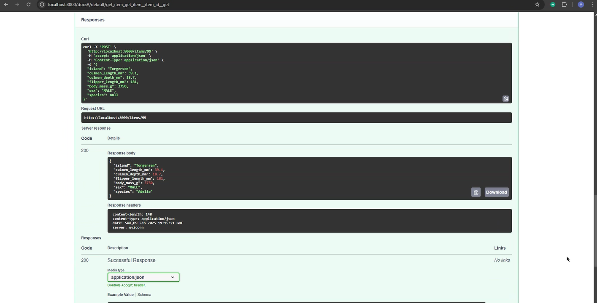

# Predicción de la Especie de Pingüinos 🐧

Este repositorio contiene un taller en el que se entrena un modelo de Machine Learning para predecir la especie de un pingüino usando el dataset **Penguins**. Además, se crea un API con **FastAPI** para realizar inferencias y se empaqueta todo en un contenedor Docker.

## Contenido del Taller

### Procesamiento y Entrenamiento del Modelo  
Se implementa un script en Python que: 
- Carga los datos del dataset. 
- Realiza la carga, limpieza, transformación, validación, ingeniería de características y división preprocesamiento, limpieza y transformación de datos. 
- Entrena un modelo de clasificación para predecir la especie del pingüino. 
- Guarda el modelo entrenado para ser usado posteriormente.

### Creación de un API con FastAPI  
Se desarrolla un servicio API que permite: 
- Permite hacer inferencia al modelo entrenado. 
- Método que permite seleccionar cual modelo será usado en el proceso de inferencia.

### Contenerización con Docker  
Se crea una imagen Docker para el API, exponiéndola en el puerto **8989**.
# 🐧 Predicción de la Especie de Pingüinos

Este repositorio contiene un taller en el que se entrena un modelo de *Machine Learning* para predecir la especie de un pingüino usando el dataset *Penguins*. Además, se crea un API con *FastAPI* para realizar inferencias y se empaqueta todo en un contenedor *Docker*.  

## 📌 Contenido del Taller  

### 📊 Procesamiento y Entrenamiento del Modelo  
Se implementa un script en Python que:  
- 📥 Carga los datos del dataset.  
- 🛠️ Realiza la limpieza, transformación, validación e ingeniería de características.  
- 📊 Divide los datos en conjuntos de entrenamiento y prueba.  
- 🤖 Entrena dos modelos de clasificación (KNN y Regresión logística) para predecir la especie del pingüino.  
- 💾 Guarda los modelos entrenados para su uso posterior.  

### 🚀 Creación de un API con FastAPI  
Se desarrolla un servicio API que:  
- 🔍 Permite hacer inferencias con el modelo entrenado.  
- 📌 Incluye un método para seleccionar qué modelo utilizar en el proceso de inferencia.  

### 🐳 Contenerización con Docker  
Se crea una imagen Docker para el API, exponiéndola en el puerto `8989`.  

Para lograr esto, se desarrolla un script de Bash (`.sh`) que:  
1. 🛑 Detiene y elimina todos los contenedores existentes.  
2. 🏗️ Construye una nueva imagen llamada `"taller"` a partir del `Dockerfile` en el directorio actual.  
3. ▶️ Ejecuta un nuevo contenedor basado en esa imagen, asignándole el nombre `"taller"` y mapeando el puerto `8000` del host al `8989` del contenedor.  

El `Dockerfile` crea una imagen de *Docker* basada en **Python 3.9**. Copia todos los archivos del directorio actual al contenedor, instala las dependencias listadas en `requirements.txt` sin usar caché, y finalmente ejecuta la aplicación con *Uvicorn*, iniciando el servidor *FastAPI* desde `main-app.py`, accesible en el puerto `8989` y escuchando en todas las interfaces de red (`0.0.0.0`).  

## 🔢 Uso del API  
El servidor *FastAPI* permite que un usuario ingrese las siguientes variables del pingüino cuya especie quiere predecir:  

- 🏝️ `"island"`  
- 📏 `"culmen_length_mm"`  
- 📏 `"culmen_depth_mm"`  
- 📏 `"flipper_length_mm"`  
- ⚖️ `"body_mass_g"`  
- ♂️♀️ `"sex"`  

Tras recibir estos valores, la API devolverá la predicción de la especie del pingüino. 🐧🔍 

Se debe estar en una linea de comandos BASH y seguir los siguientes pasos:

1. Entrar en la ruta taller-01
2. Ejecutar ./docker-init.sh
3. Ingresar a http://localhost:8000/docs

Ingresar los siguientes datos por ejempo:
{
  "island": "Torgersen",
  "culmen_length_mm": 39.1,
  "culmen_depth_mm": 18.7,
  "flipper_length_mm": 181,
  "body_mass_g": 3750,
  "sex": "MALE",
  "species": null
}
 
La API retornará:

{
  "island": "Torgersen",
  "culmen_length_mm": 39.1,
  "culmen_depth_mm": 18.7,
  "flipper_length_mm": 181,
  "body_mass_g": 3750,
  "sex": "MALE",
  "species": 'Adelie'
}

---

📌 **Autor:** *Luis, Miguel, Camilo*  
📌 **Tecnologías utilizadas:** Python, FastAPI, Docker, Uvicorn  
