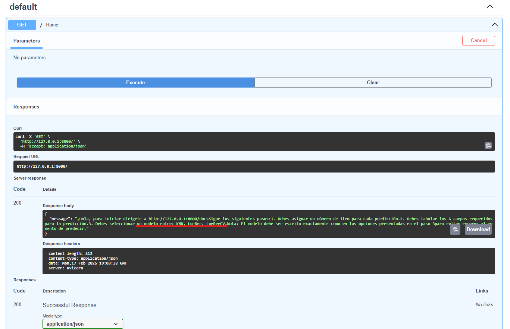
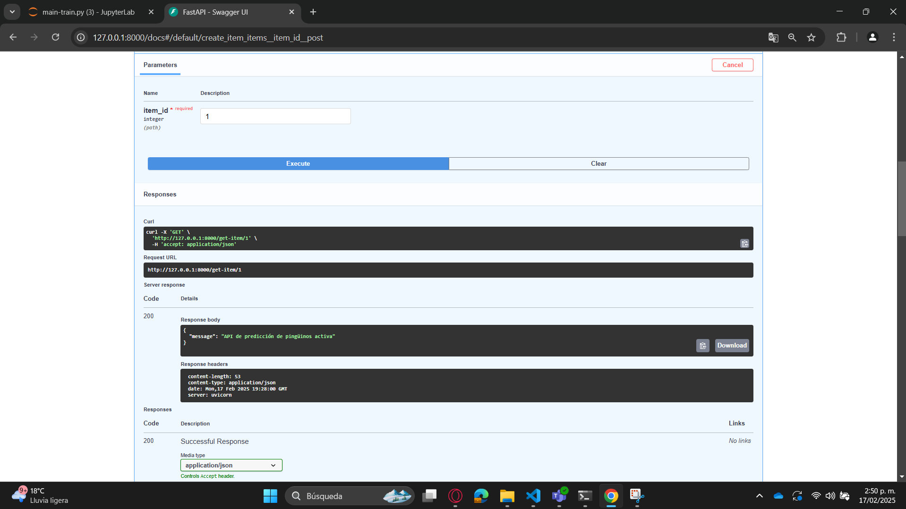
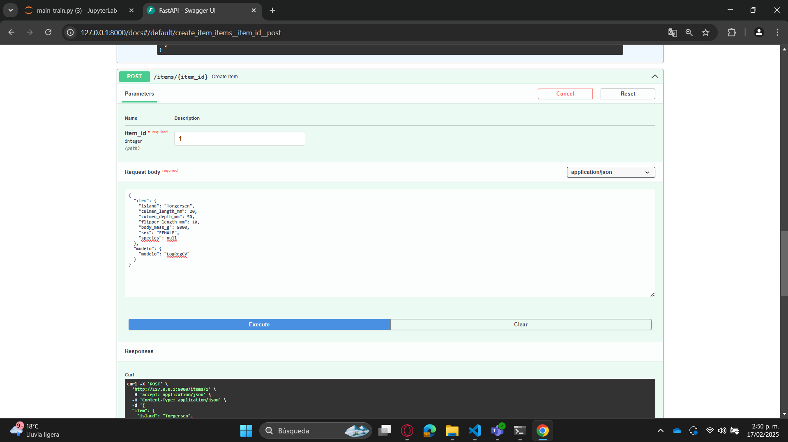
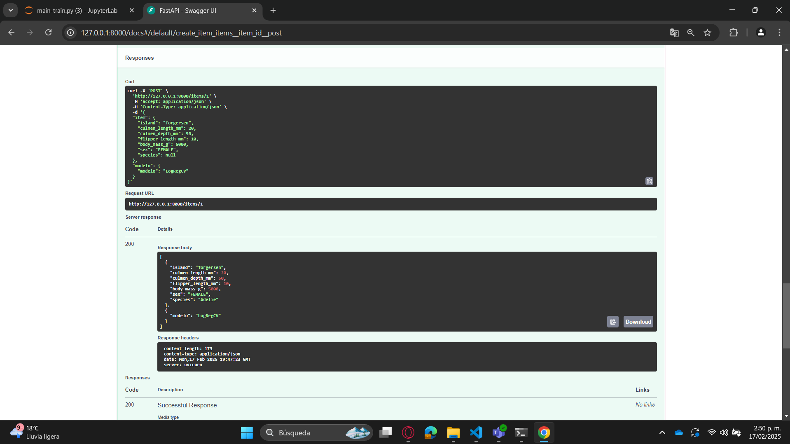

# Predicción de la Especie de Pingüinos 🐧

Este repositorio contiene un taller en el que se entrena un modelo de Machine Learning para predecir la especie de un pingüino usando el dataset **Penguins**. Además, se crea un API con **FastAPI** para realizar inferencias y se empaqueta todo en un contenedor Docker.

## Contenido del Taller

### Procesamiento y Entrenamiento del Modelo  
Se implementa un script en Python que: 
- Carga los datos del dataset. 
- Realiza la carga, limpieza, transformación, validación, ingeniería de características y división preprocesamiento, limpieza y transformación de datos. 
- Entrena un modelo de clasificación para predecir la especie del pingüino. 
- Guarda el modelo entrenado para ser usado posteriormente.

### Creación de un API con FastAPI  
Se desarrolla un servicio API que permite: 
- Permite hacer inferencia al modelo entrenado. 
- Método que permite seleccionar cual modelo será usado en el proceso de inferencia.

### Contenerización con Docker  
Se crea una imagen Docker para el API, exponiéndola en el puerto **8989**.
# 🐧 Predicción de la Especie de Pingüinos

Este repositorio contiene un taller en el que se entrena un modelo de *Machine Learning* para predecir la especie de un pingüino usando el dataset *Penguins*. Además, se crea un API con *FastAPI* para realizar inferencias y se empaqueta todo en un contenedor *Docker*.  

## 📌 Contenido del Taller  

### 📊 Procesamiento y Entrenamiento del Modelo  
Se implementa un script en Python que:  
- 📥 Carga los datos del dataset.  
- 🛠️ Realiza la limpieza, transformación, validación e ingeniería de características.  
- 📊 Divide los datos en conjuntos de entrenamiento y prueba.  
- 🤖 Entrena dos modelos de clasificación (KNN y Regresión logística) para predecir la especie del pingüino.  
- 💾 Guarda los modelos entrenados para su uso posterior.  

### 🚀 Creación de un API con FastAPI  
Se desarrolla un servicio API que:  
- 🔍 Permite hacer inferencias con el modelo entrenado.  
- 📌 Incluye un método para seleccionar qué modelo utilizar en el proceso de inferencia.  

### 🐳 Contenerización con Docker  
Se crea una imagen Docker para el API, exponiéndola en el puerto `8989`.  

Para lograr esto, se desarrolla un script de Bash (`.sh`) que:  
1. 🛑 Detiene y elimina todos los contenedores existentes.  
2. 🏗️ Construye una nueva imagen llamada `"taller"` a partir del `Dockerfile` en el directorio actual.  
3. ▶️ Ejecuta un nuevo contenedor basado en esa imagen, asignándole el nombre `"taller"` y mapeando el puerto `8000` del host al `8989` del contenedor.  

El `Dockerfile` crea una imagen de *Docker* basada en **Python 3.9**. Copia todos los archivos del directorio actual al contenedor, instala las dependencias listadas en `requirements.txt` sin usar caché, y finalmente ejecuta la aplicación con *Uvicorn*, iniciando el servidor *FastAPI* desde `main-app.py`, accesible en el puerto `8989` y escuchando en todas las interfaces de red (`0.0.0.0`).  

## 🔢 Uso del API  
El servidor *FastAPI* permite que un usuario ingrese las siguientes variables del pingüino cuya especie quiere predecir:  

- 🏝️ `"island"`  
- 📏 `"culmen_length_mm"`  
- 📏 `"culmen_depth_mm"`  
- 📏 `"flipper_length_mm"`  
- ⚖️ `"body_mass_g"`  
- ♂️♀️ `"sex"`  

Tras recibir estos valores, la API devolverá la predicción de la especie del pingüino. 🐧🔍 

##  🐳 Configuración con Docker Compose
Este proyecto utiliza docker-compose para gestionar los servicios de la API y JupyterLab de manera eficiente, integrando además el uso de Uvicorn para manejar las dependencias.

- 📄 docker-compose.yml
El archivo docker-compose.yml define dos servicios principales:

API (Servidor FastAPI para inferencias)
Construye la imagen desde el directorio ./api.
Expone el puerto 8000 del host, mapeándolo al puerto 80 del contenedor.
Monta los volúmenes ./api:/api y ./train:/train para compartir archivos entre el contenedor y el host.
Ejecuta uvicorn para iniciar la API (main-app:app) en 0.0.0.0:80, permitiendo inferencias a través de la API.
jupyterlab (Entorno interactivo para entrenamiento y pruebas)
Construye la imagen desde el directorio ./train.
Nombra el contenedor como jupyterlab.
Usa /train como directorio de trabajo.
Monta el volumen ./train:/train para compartir datos entre el contenedor y el host.
Expone el servicio en el puerto 8888, accesible en http://localhost:8888.
Ambos servicios compartirán los modelos entrenados porque en ambos se estableció volumen: ./train:/train, lo que permite que el modelo guardado en JupyterLab sea consumido por la API para realizar inferencias.

Sigue estos pasos desde la línea de comandos BASH:

1. Navega a la ruta taller-02.
2. Ejecuta el comando docker-compose up --build
3. Accede a http://127.0.0.1:8888/lab y ejecuta el notebook "main-train.py" 
4. Si se desea entrenar un nuevo modelo, las modificaciones deben realizarse en el notebook "model_creation". Cada vez que se entrene un nuevo modelo, este estará disponible para ser utilizado en la API.
5. Luego, ingresa a http://localhost:8000/docs.
6. Registra un número de ítem.
7. Completa los datos requeridos para realizar la predicción, seleccionando el modelo de entre las opciones proporcionadas por el cuerpo de respuesta del GET en /home donde podrás ver los modelos disponibles para hacer la predicción.

Ejemplo de implementación de la predicción:

{
  "item": {
    "island": "Torgersen",
    "culmen_length_mm": 20,
    "culmen_depth_mm": 50,
    "flipper_length_mm": 10,
    "body_mass_g": 5000,
    "sex": "FEMALE",
    "species": null
  },
  "modelo": {
    "modelo": "LogRegCV"
  }
}'

 
La API retornará el campo de species actualizado:
[
  {
    "island": "Torgersen",
    "culmen_length_mm": 20,
    "culmen_depth_mm": 50,
    "flipper_length_mm": 10,
    "body_mass_g": 5000,
    "sex": "FEMALE",
    "species": "Adelie"
  },
  {
    "modelo": "LogRegCV"
  }
]

📌 **Autor:** *Luis, Miguel, Camilo*  
📌 **Tecnologías utilizadas:** Python, FastAPI, Docker compose, Uvicorn  
