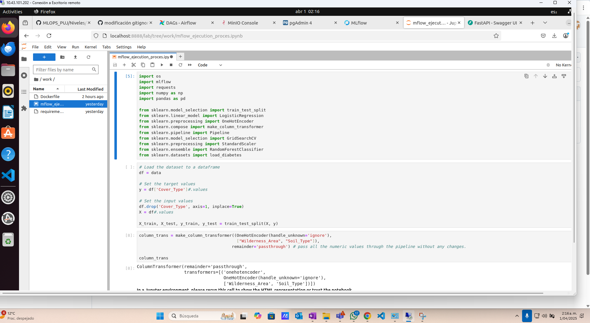
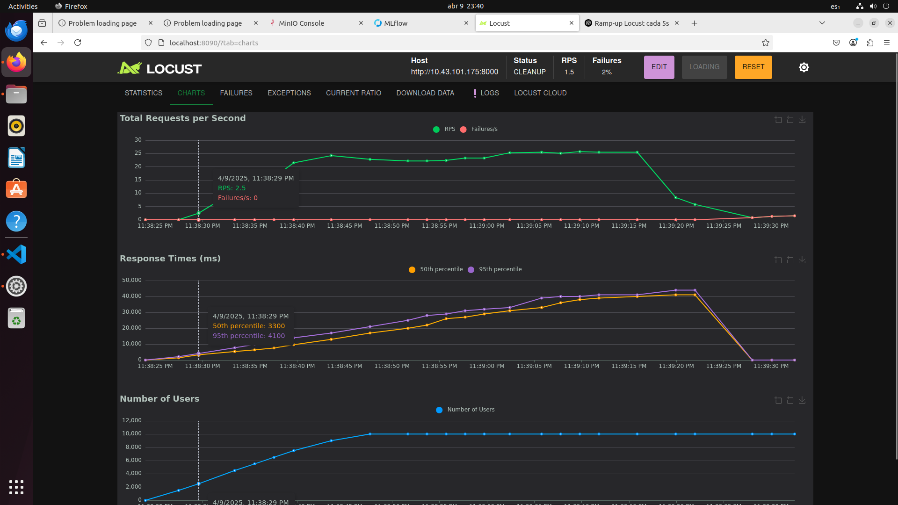
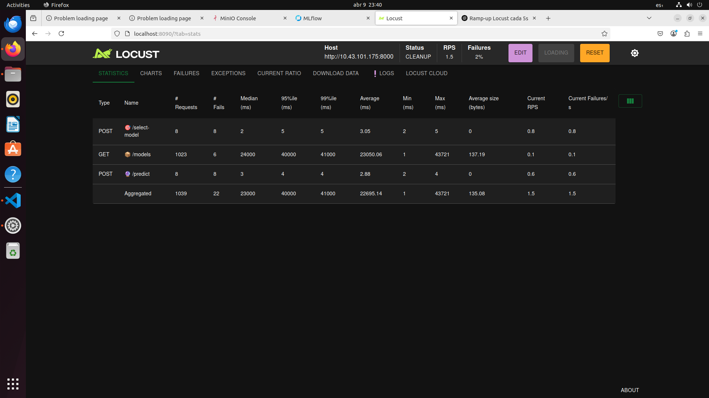
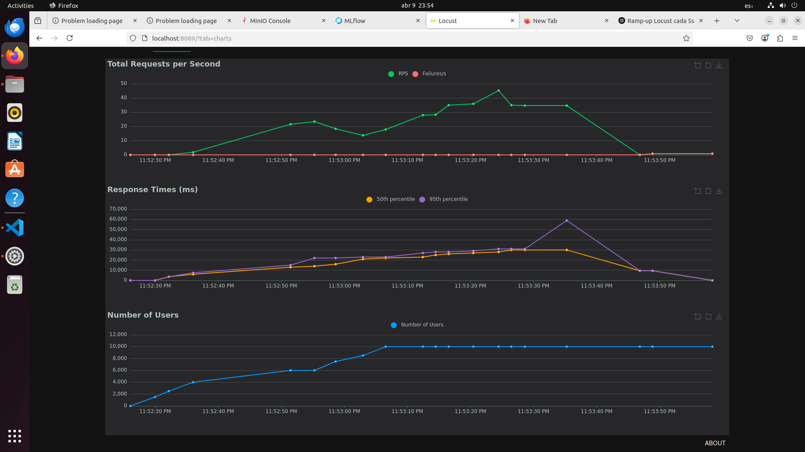
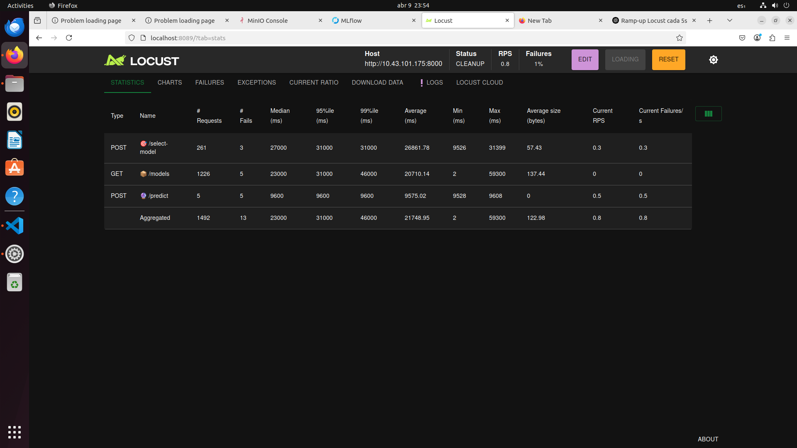
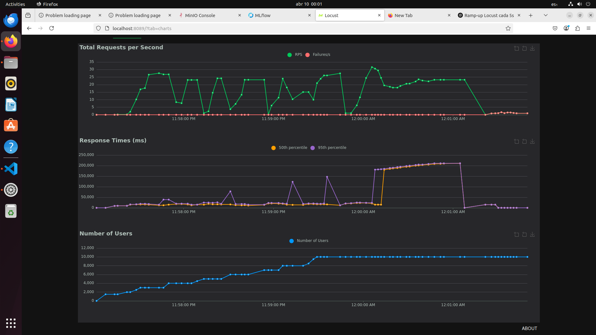

# 🚀 README para el Clúster de Airflow con CeleryExecutor, Redis y PostgreSQL

Este repositorio configura un entorno de desarrollo local para ejecutar Apache Airflow con CeleryExecutor, Redis como broker de tareas y PostgreSQL como backend de la base de datos. Además, el entorno incluye MinIO para almacenamiento de artefactos, MySQL para almacenar metadata de MLFlow, PgAdmin para monitorear la base de datos de airflow y JupyterLab como ambiente de desarrollo.

---

## 🐳 Servicios en Docker Compose

El entorno de desarrollo está compuesto por varios contenedores Docker que incluyen Airflow, bases de datos, almacenamiento de artefactos y más. A continuación, se describen los servicios principales:

### 1. **🔄 Airflow**: Clúster con CeleryExecutor

Airflow se ejecuta utilizando CeleryExecutor, y se conecta a Redis para la gestión de tareas y PostgreSQL para el almacenamiento de metadatos.

- **🖥️ Airflow Webserver**: Accede a la UI de Airflow en `http://localhost:8080`
- **⏰ Airflow Scheduler**: Controla la ejecución de tareas programadas.
- **👷 Airflow Worker**: Ejecuta las tareas programadas por el scheduler.
- **🔔 Airflow Triggerer**: Gestiona trabajos que activan tareas manualmente.

  

### 2. **📮 Redis**: Broker de Celery

Redis se usa como broker para las tareas de Celery. Es necesario para la comunicación entre el `Scheduler` y los `Workers` de Airflow.

### 3. **🗃️ PostgreSQL**: Backend de Airflow

PostgreSQL se usa como base de datos para almacenar los metadatos de Airflow. Se conecta con los `Scheduler` y `Workers`.

### 4. **📦 MinIO**: Almacenamiento S3

MinIO emula un almacenamiento tipo S3, utilizado para almacenar los artefactos de MLFlow.

- Accede a la consola web de MinIO en `http://localhost:9001` utilizando las credenciales:
  - Usuario: `admin`
  - Contraseña: `supersecret`

- Se debe crear el bucket para almacenar los artefactos de MLFLOW en la interfaz gráfica por medio del botón "Create bucket" y este debe llamarse mlflows3 para que mlflow pueda reconocerlo y se guarde la información.


### 5. **📊 MLFlow**: Plataforma de Gestión de Experimentos

MLFlow se utiliza para el seguimiento de experimentos de Machine Learning. Se conecta a MySQL para almacenar metadatos.

- Accede a la interfaz web de MLFlow en `http://localhost:5000`.


### 6. **🔍 PgAdmin**: Interfaz de Administración de PostgreSQL

PgAdmin proporciona una interfaz gráfica para gestionar la base de datos de PostgreSQL.

- Accede a la interfaz web de PgAdmin en `http://localhost:5050`.
  - Usuario: `admin@example.com`
  - Contraseña: `admin`
Se debe registrar la base de datos con:
- hostname: postgres
- user: airflow
- password: airflow

Para esto se da click en "Servers">"Register" y se ingresan los datos anteriores. Luego se da "Save". Aparecerá la base de datos a la cual si se despliega se podrá dar click derecho y poner "Query tools" y luego hacer consultas como por ejemplo "select * from covertype".

De este modo se puede comprobar que los datos que airflow genera con el dag Cargar_datos.py están cargados a la base de datos de Postgresql


### 7. **💾 MySQL**: Base de Datos de MLFlow

MySQL se usa para almacenar los metadatos de MLFlow. Se conecta con el contenedor de MLFlow.

### 8. **🧪 JupyterLab**: Entorno de Desarrollo

JupyterLab proporciona un entorno interactivo para desarrollo y pruebas. Puedes acceder a él en `http://localhost:8888` usando el token `devtoken`.



### 9. **🔌 FastAPI (API)**: API de Inferencia

FastAPI proporciona un servidor para exponer endpoints que interactúan con otros servicios como Airflow y MLFlow. Accede al servidor en `http://localhost:8000/docs`.

Aqui se puede utilizar el mejor modelo generado tras los experimentos de MLFLOW para realizar inferencia.

* Nota: el modelo debe estar en estado de producción en Mlflow y debe llamarse modelo1.


### 10. **🌐 FastAPI (API Server)**: Servidor de API

Esta API simula una URL de internet que provee un batch de datos cada 5 segundos, para un total de 10 batches, los cuales serán utilizados para entrenar posteriormente el modelo en airflow y registrar los experimentos y el mejor modelo en mlflow. Los datos se almacenan en la base de datos "airflow" dentro de la tabla "covertype".
`http://localhost:80`.

---

## 📋 Uso

Para ejecutar los contenedores y configurar el entorno, sigue estos pasos:

IP MV: 10.43.101.202


1. **🛠️ Construir los contenedores**:

   En el directorio raíz del proyecto, ejecuta:

   ```bash
   docker-compose up -d --build
   ```
    Para ver el estatus de los servicios:
   ```bash
   docker-compose ps
   ```
    Para bajar los servicios:
   ```bash
   docker-compose down
   ```

   Para bajar los servicios limpiando todo:
   ```bash
   docker-compose down --volumes --remove-orphans
   ```

2. **▶️ Prender dags programados**:

    En airflow existen 4 dags que se ejecutan diariamente desde el 30 de marzo del 2025:
    1. 🗑️ **Borrar_datos**: limpia la base de datos si existe. Se ejecuta posterior a la generación del modelo y está programado 1 hora después de el primer dag. 
    2. 📥 **Cargar_datos**: trae los datos consolidados de la api server tarda aproximadamente 50 segundos y está programado a las 0 horas.
    3. 🧠 **Entrenamiento_mode**: entrena un RandomForest con los datos cargados, el cual está programado 2 minutos después de cargar los datos.
    4. ⚙️ **Procesa_data**: genera experimentos para encontrar los mejores hiperparámetros y por ende el mejor modelo que será utilizado posteriormente por el usuario. Se ejecuta 10 minutos después de cargar los datos.


    * ⚠️ La ejecución recomendada para efectuar el proceso por completo es ejecutar los dags en el orden en el que están enumerados: primero se limpia la base de datos si existe, se cargan los datos, se entrena el modelo y se genera experimentos.

3. **🔮 Inferencia en API**:
    Tras la ejecución de los dags, el usuario ingresará a `http://localhost:8000/docs/`, donde podrá hacer inferencia con el modelo como el siguiente ejemplo:

    1. FastAPI proporciona un servidor para exponer endpoints que interactúan con otros servicios como Airflow y MLFlow. Accede al servidor en http://localhost:8000/docs.

Aqui se puede utilizar el mejor modelo generado tras los experimentos de MLFLOW para realizar inferencia.

Nota: el modelo debe estar en estado de producción en Mlflow y debe llamarse modelo1.

4. **📈 Prueba de carga con Locust**

---

## 🔌 Endpoints de la API

### `POST /select-model`
Selecciona el modelo que se usará para predicción.

```json
{
  "model_name": "modelo1"
}
```

### `POST /predict`

Realiza una inferencia con el modelo seleccionado.

```json
{
  "Elevation": 1,
  "Aspect": 1,
  "Slope": 1,
  "Horizontal_Distance_To_Hydrology": 1,
  "Vertical_Distance_To_Hydrology": 1,
  "Horizontal_Distance_To_Roadways": 1,
  "Hillshade_9am": 1,
  "Hillshade_Noon": 1,
  "Hillshade_3pm": 1,
  "Horizontal_Distance_To_Fire_Points": 1,
  "Wilderness_Area": "Rawah",
  "Soil_Type": "C7745"
}
```

## 🚦 Pruebas de Carga con Locust

Locust permite simular múltiples usuarios haciendo peticiones concurrentes a la API.

### 📜 Definición de prueba (locustfile.py)

Cada usuario simulado:

- 🔍 Consulta los modelos disponibles (GET /models)
- 🎯 Selecciona un modelo (POST /select-model)
- 🧮 Envía una solicitud de predicción (POST /predict)
- ⏱️ Espera entre 1 y 2.5 segundos antes de repetir

### 🐳 Uso con Docker Compose

#### 🔧 Levantar todos los servicios

```bash
docker-compose up --build
```

#### 🌐 Accesos rápidos

- 📝 FastAPI Docs: http://localhost:8000/docs
- 🧪 JupyterLab: http://localhost:8888
- 📊 Locust UI: http://localhost:8089

## ⚖️ Escalamiento y Pruebas de Rendimiento

Se realizaron pruebas de rendimiento utilizando diferentes configuraciones de réplicas para evaluar el comportamiento del sistema bajo carga. Las pruebas mostraron resultados significativos sobre el impacto de la escalabilidad horizontal en el rendimiento del sistema.

### 🔬 Hallazgos principales:

1. **🔴 Sin réplicas (1 instancia)**:
   - Recursos: 10GB RAM, 0.5 CPU
   - Rendimiento: Solo se logró completar con éxito las peticiones GET (mapeo de modelos)
   - Las operaciones POST más intensivas fallaron bajo carga
   - Desempeño:
      
   - Estadísticas:
      

2. **🟠 Con 2 réplicas**:
   - Recursos por instancia: 5GB RAM, 0.25 CPU (total: 10GB RAM, 0.5 CPU)
   - Rendimiento: Se logró completar con éxito las peticiones GET y POST para seleccionar modelos
   - Las peticiones de predicción (POST /predict) aún presentaban fallos
   - **Capturas de pantalla**:
     - Desempeño:
     
     - Estadísticas:
     

3. **🟢 Con 4 réplicas**:
   - Recursos por instancia: 2.5GB RAM, 0.125 CPU (total: 10GB RAM, 0.5 CPU)
   - Rendimiento: Se logró completar todo el flujo de trabajo con éxito, incluyendo las operaciones de predicción
   - Mejor estabilidad general del sistema
   - **Capturas de pantalla**:
     - Desempeño:
     
     - Estadísticas: 
     
     

### 💡 Conclusiones:

Las pruebas demostraron que aunque el total de recursos asignados se mantuvo constante (10GB RAM, 0.5 CPU), la distribución de estos recursos en múltiples instancias más pequeñas mejoró significativamente el rendimiento y la estabilidad del sistema. El escenario con 4 réplicas mostró el mejor comportamiento a pesar de utilizar exactamente los mismos recursos totales que las configuraciones con menos réplicas. Lo otro que me parece importante mencionar es que se nota una diferencia de comportamientos cuando hay 4 réplicas y se observan picos de carga.

Una posible hipótesis para explicar este comportamiento es que, al lanzar múltiples contenedores de Locust simultáneamente, todos los workers comienzan a generar carga al mismo tiempo. Por ejemplo, si se definen 500 usuarios distribuidos en 5 contenedores, cada worker manejará 100 usuarios que empiezan su actividad sin pausas iniciales, lo que genera un gran pico de tráfico al comienzo de la prueba. Esta sincronización podría estar influyendo en los picos de carga observados en las pruebas con múltiples réplicas.

Este hallazgo confirma que para aplicaciones como la API de inferencia de modelos ML, la escalabilidad horizontal (aumentar el número de instancias) puede ser más efectiva que la escalabilidad vertical (aumentar los recursos de una única instancia).

Las evidencias completas de estas pruebas se encuentran disponibles en la carpeta taller-locust/images/con replicas y taller-locust/images/sin replicas. `taller-locust/images/con replicas` y `taller-locust/images/sin replicas`.

---

## ⚠️ Importante

  * Para poder almacenar los modelos y experimentos de MLFLOW se debe haber creado el bucket manualmente en MINIO con el nombre mlflows3, al no hacerlo no se registrara la informacion en MLFLOW. 
  * Para poder hacer inferencia de la API por primera vez se debe realizar todo el proceso de ejecucion de los dags debido a que la api requiere del modelo que se genera en el dag 3. Si esto no se aplica entonces la API no se habilitara.

## 👥 Autores

* 👨‍💻 Luis Frontuso
* 👨‍💻 Miguel Zuñiga
* 👨‍💻 Camilo Serrano